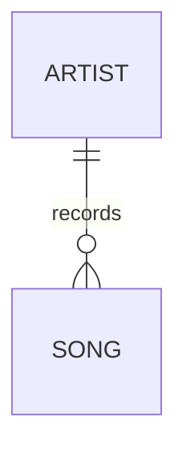
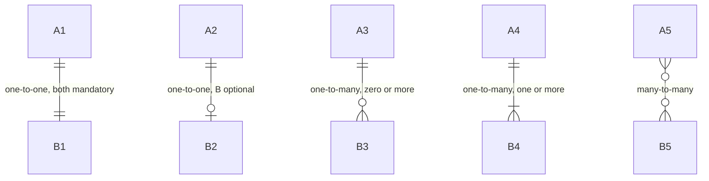
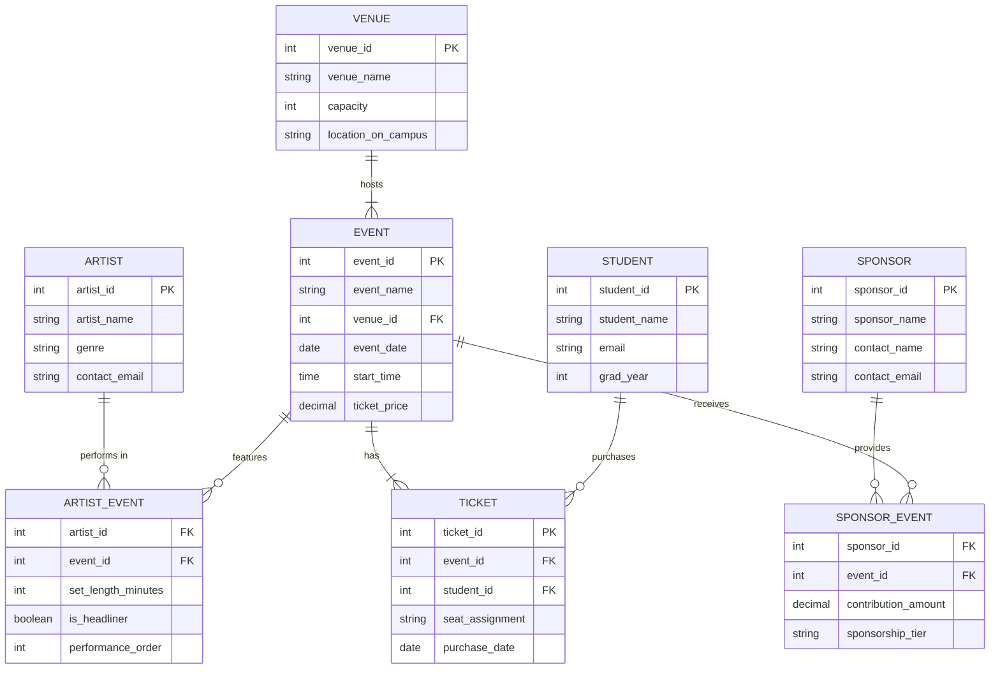

# Chapter 6: Data Modeling in Practice

By the end of this chapter, you will be able to:

- **Read** and **draw** an entity-relationship diagram using crow's foot notation, correctly distinguishing mandatory from optional participation on each side of a relationship.
- **Extract** entities and relationships from a plain-language business description, and **resolve** ambiguities in the requirements by identifying assumptions that need to be confirmed with stakeholders.
- **Translate** an ER diagram into a relational schema by applying the four translation rules, and **determine** when a many-to-many junction table should be promoted to a full entity with its own primary key.
- **Evaluate** a database design against common red flags such as catch-all tables, vague columns, and nullable foreign keys, and **distinguish** an additive schema change from a breaking one when revising a design.

---

Everything we've covered so far has been building toward one practical skill: the ability to look at a real business situation and design a database that models it correctly.

You know what entities and attributes are. You understand the three types of relationships and how to represent them. You know what normalization is trying to accomplish and what the normal forms require. Now it's time to put all of that together - to go from a description of a business in plain English to a database design you could actually build.

This chapter is about the full design process: how to read a business situation, draw an entity-relationship diagram, translate that diagram into a relational schema, and evaluate and improve the result. It's the most practical chapter in Unit 2, and the skills here are ones you'll use every time you work with data.

---

## 6.1 Entity-Relationship Diagrams as a Communication Tool

### Why ER diagrams exist: bridging business and technical perspectives

An **entity-relationship diagram** (ER diagram) is a visual map of a database design. It shows the entities, their attributes, and the relationships between them - all in a format that can be understood by both the people who know the business and the people who build the database.

That dual audience is the whole point. A database design that only the developer understands is fragile - it might not reflect how the business actually works. A design that only the business stakeholder understands can't be built. The ER diagram is the shared language that bridges the gap.

Think about what happens when a company decides to build a new app. There are product managers who understand what the app needs to do, designers who understand the user experience, and developers who need to build the underlying system. The ER diagram is the artifact that brings these groups into alignment. When everyone looks at the same diagram and agrees it represents the business correctly, the developers have a blueprint they can trust.

### The diagram as a shared language, not a technical artifact

This framing matters: an ER diagram is not primarily a technical document. It's a communication tool.

A good ER diagram should be legible to anyone who understands the business, even if they've never written a line of code. If you show your ER diagram to a product manager and they say "wait, that's not how our membership levels work," that's the diagram doing its job - surfacing a misunderstanding before it gets built into the system.

**The most expensive time to fix a design mistake is after the database has been built, loaded with data, and connected to a live application.** The cheapest time is when it's a drawing on a whiteboard. ER diagrams exist to keep mistakes in the cheap phase.

### Who should be in the room when you draw one

Drawing an ER diagram should involve at least two types of people: someone who understands the business domain deeply, and someone who understands database design. Ideally, both are in the room at the same time.

The business person catches mistakes about how the real world works: "Actually, a customer can have multiple billing addresses, not just one." The database designer catches structural problems: "If we model it that way, we'll have this many-to-many relationship that needs a junction table." Neither person can do both jobs equally well. The diagram is the meeting point.

In your career, you may play either role - or both. **As an MIS professional, you'll frequently be the bridge: technical enough to translate business requirements into database designs, and business-literate enough to know when the design doesn't match the reality.**

### Reading and drawing ER diagrams

There are several ER diagramming notations in common use. We'll use **crow's foot notation**, which is the most widely used in practice and the most intuitive once you understand the symbols.

In crow's foot notation, entities are represented as rectangles, and relationships are represented as lines connecting them. The symbols at the ends of the lines indicate the **cardinality** of the relationship - how many instances of each entity can participate.

The three symbols you need to know:

```
|    exactly one (mandatory)
o    zero (optional)
{    many
```

These are combined in pairs to express the minimum and maximum participation of each entity:

```
||      one and only one (exactly one)
o|      zero or one (optional, but not more than one)
|{      one or more (at least one, possibly many)
o{      zero or more (optional, any number)
```

When you read the relationship between two entities, you say the first entity, then you say the cardinality closest to the second entity, then you say the second entity.

Here's how to the relationships between Artist and Song in text notation:

```
ARTIST ||--o{ SONG
```

Reading left to right: An artist (the first entity) is associated with zero or more (the cardinality closest to Song) Songs (the second entity). 

Reading right to left: A Song (the first entity) is associated with one and only one (the cardinality closest to Artist) Artist (the second entity). 

This two-directional reading is how you interpret any relationship line: read each direction separately to understand both sides of the relationship.

The text notation is useful because you can type it anywhere - in a document, a chat window, or an email - without needing a diagram tool. When we draw the diagram, we can also label the relationship. Here's what the relationship between Artist and Song looks like when rendered as a proper ER diagram:



*Notice that the relationship label "records" works well when read in one direction (an Artist "records" one or more Songs), but you have to change the label a little when you read the relationship in the other direction (a Song "is recorded by" one and only one Artist).*

### Minimum and maximum cardinality: mandatory vs. optional

The distinction between "mandatory" and "optional" participation matters for real database design.

Consider the Artist-Song relationship. Is it mandatory that every song has an artist? In most music databases, yes - a song without an artist is meaningless. So the Song side is mandatory ||.

Is it mandatory that every artist has at least one song? No - a newly signed artist might be in the system before any of their songs are loaded. So the Artist side is optional o{ from the Song's perspective: a song requires exactly one artist, but an artist can have zero or more songs.

Common cardinality patterns in text notation:

```
A ||--|| B     One-to-one, both mandatory
A ||--o| B     One-to-one, B is optional
A ||--o{ B     One-to-many: each A has zero or more B's; each B has exactly one A
A ||--|{ B     One-to-many: each A has one or more B's (at least one required)
A }o--o{ B     Many-to-many (usually via a junction table)
```

And here's how those same five patterns render visually - notice how the crow's foot symbol (the branching lines on the "many" end) makes the cardinality immediately readable at a glance:



The mandatory/optional distinction determines whether you need NOT NULL constraints on foreign keys and whether the junction table for a many-to-many relationship requires rows before something else can be created.

---

## 6.2 From Business Narrative to ER Diagram

### Extracting entities and relationships from a prose description

The raw material for a database design is almost always a description in plain English - a conversation with a stakeholder, a requirements document, a paragraph describing how a business works. Your job is to extract the structure from the prose.

The reliable starting technique: **underline the nouns and circle the verbs.**

Nouns are your candidate entities. Verbs are your candidate relationships.

Let's try it with a real example. Here's a business description for a campus music event organization:

*"Our organization puts on live music events on campus. We book artists to perform at specific events. Each event happens at one campus venue and has a set start time and ticket price. Students buy tickets to attend events. A student can buy multiple tickets to the same event to bring friends. Each ticket has a seat or standing area assignment. We also have sponsors who contribute money to support events; a sponsor can support multiple events and an event can have multiple sponsors."*

**Nouns (candidate entities):**
- Organization (probably not - it's the system owner, not something we track)
- Artist
- Event
- Venue
- Ticket
- Student
- Seat / Standing Area (probably an attribute of Ticket)
- Sponsor

**Verbs (candidate relationships):**
- Artist *performs at* Event
- Event *happens at* Venue
- Student *buys* Ticket
- Ticket *is for* Event
- Sponsor *supports* Event

Now we can start classifying relationships:
- Artist performs at Event: an artist can perform at many events; an event can have multiple artists → **many-to-many**
- Event happens at Venue: an event happens at one venue; a venue can host many events → **many-to-one** (or one-to-many from Venue's perspective)
- Student buys Ticket: a student can buy many tickets → **one-to-many**
- Ticket is for Event: a ticket is for one event; an event has many tickets → **many-to-one**
- Sponsor supports Event: a sponsor can support many events; an event can have many sponsors → **many-to-many**

### What to do when the narrative is ambiguous

Business descriptions are almost always ambiguous. The narrative above has at least one ambiguity hiding in it: "a student can buy multiple tickets to the same event to bring friends." Does this mean one ticket row per student per event (with a quantity), or one ticket row per physical ticket (so three tickets for three friends means three rows)?

This matters enormously for the design. If it's one row with a quantity, the Ticket table has a `quantity` column. If it's one row per physical ticket, the Ticket table has one row per piece of paper, and there's no quantity column.

Neither design is wrong in the abstract. Which one is right depends on the business need: do you need to track each individual attendee separately (for seat assignment, check-in scanning, etc.), or just the number of tickets a student bought? The description doesn't say.

When the narrative is ambiguous, you ask. Don't guess and design - guess and document, then validate.

### Resolving ambiguity in business requirements

Ambiguity resolution is one of the most valuable skills a database designer can have. Here are the questions you'd ask to resolve the ambiguities in our campus music example:

*"Does each ticket correspond to a specific seat, or are some events general admission?"*
This determines whether `seat_assignment` is always present or sometimes null on a ticket.

*"When a student buys three tickets for friends, do we need to track which friend attended which ticket? Or do we just need to know the student bought three tickets?"*
This determines the grain of the Ticket table.

*"Can the same artist perform at the same event more than once - like an opening act who comes back for an encore?"*
This determines whether the Artist-Event junction table needs a unique constraint on the (artist_id, event_id) combination.

*"When a sponsor 'supports' an event, do we need to track the contribution amount? Or just the fact that they're a sponsor?"*
This determines what data the Sponsor-Event junction table carries.

Each of these questions could change the design significantly. Asking them before building is free. Discovering the wrong answer after building is expensive.

### Documenting assumptions explicitly

Not every ambiguity can be resolved immediately. Sometimes the stakeholder doesn't know yet. Sometimes the answer will change. In those cases, document your assumptions explicitly - write them down as part of the design.

For example:

*"Assumption: Each ticket corresponds to one physical attendee and has one seat/standing area assignment. If the business later needs to support group tickets, the Ticket table will need to be restructured."*

*"Assumption: The Sponsor-Event relationship tracks that a sponsor supported an event, but not the contribution amount. If financial tracking is added later, the SponsorEvent junction table will need a `contribution_amount` column."*

Documented assumptions are not weaknesses - they're honesty. They tell future maintainers what decisions were made and why, so that when requirements change (and they always do), the right parts of the design can be updated.

---

## Building the ER Diagram

With entities identified and relationships classified, we can draw the ER diagram. We'll do this in two steps: first in text notation (which you can type anywhere), then as a fully rendered diagram.

**Text notation:**

```
VENUE ||--|{ EVENT : "hosts"
ARTIST ||--o{ ARTIST_EVENT : "performs in"
EVENT ||--o{ ARTIST_EVENT : "features"
EVENT ||--|{ TICKET : "has"
STUDENT ||--o{ TICKET : "purchases"
SPONSOR ||--o{ SPONSOR_EVENT : "provides"
EVENT ||--o{ SPONSOR_EVENT : "receives"
```

Notice that the two many-to-many relationships (Artist-Event and Sponsor-Event) are now fully expanded: each is shown as two one-to-many relationships meeting at a junction table. This is how a real ER diagram represents many-to-many relationships - you always draw the junction table explicitly.

**Rendered diagram:**



The rendered diagram gives you something you can walk a stakeholder through in a meeting. The text notation gives you something you can type into an email, a chat window, or an AI tool. Both represent the same design - know both, use whichever fits the situation.

---

## 6.3 From ER Diagram to Relational Schema

### Translating entities into tables

The translation from ER diagram to relational schema follows clear rules. Most of the work has already been done - the ER diagram is essentially the schema in visual form.

**Rule 1: Each entity becomes a table.** The entity name becomes the table name. The entity's attributes become columns.

**Rule 2: The entity's identifier becomes the primary key.** If you don't have a natural key, add a surrogate key (an auto-incrementing integer is the most common choice).

**Rule 3: Each one-to-many relationship becomes a foreign key on the "many" side.** The "many" table gets a column that references the primary key of the "one" table.

**Rule 4: Each many-to-many relationship becomes a junction table.** The junction table has foreign keys to both entities, and together those foreign keys form the primary key (or you can add a surrogate key).

Let's apply these rules to the campus music system.

### One entity → one table (usually)

**VENUE table:**
| Column | Type | Notes |
|--------|------|-------|
| venue_id | integer | Primary key (surrogate) |
| venue_name | varchar | e.g., "Joan C. Edwards Performing Arts Center" |
| capacity | integer | Maximum attendance |
| location_on_campus | varchar | Building description or map reference |

**ARTIST table:**
| Column | Type | Notes |
|--------|------|-------|
| artist_id | integer | Primary key (surrogate) |
| artist_name | varchar | |
| genre | varchar | |
| contact_email | varchar | Booking contact |

**EVENT table:**
| Column | Type | Notes |
|--------|------|-------|
| event_id | integer | Primary key (surrogate) |
| event_name | varchar | e.g., "Spring Concert 2026" |
| venue_id | integer | Foreign key → VENUE |
| event_date | date | |
| start_time | time | |
| ticket_price | decimal | |

**STUDENT table:**
| Column | Type | Notes |
|--------|------|-------|
| student_id | integer | Primary key (could use university ID as natural key) |
| student_name | varchar | |
| email | varchar | Unique |
| grad_year | integer | |

**TICKET table:**
| Column | Type | Notes |
|--------|------|-------|
| ticket_id | integer | Primary key (surrogate) |
| event_id | integer | Foreign key → EVENT |
| student_id | integer | Foreign key → STUDENT |
| seat_assignment | varchar | e.g., "Section B, Row 4, Seat 12" or "General Admission" |
| purchase_date | date | |

**SPONSOR table:**
| Column | Type | Notes |
|--------|------|-------|
| sponsor_id | integer | Primary key (surrogate) |
| sponsor_name | varchar | e.g., "Marshall University Student Government" |
| contact_name | varchar | |
| contact_email | varchar | |

### Attributes become columns; identifier becomes primary key

Notice what happened to the EVENT table: it got a `venue_id` foreign key rather than the venue's name or city. The venue information lives in the VENUE table - EVENT just holds the pointer. This is the normalization principle in action: one fact, one home.

Also notice that EVENT doesn't have artist information - because the Artist-Event relationship is many-to-many, it gets its own junction table.

### Handling many-to-many relationships with junction tables

The two many-to-many relationships need junction tables:

**ARTIST_EVENT table (junction):**
| Column | Type | Notes |
|--------|------|-------|
| artist_id | integer | Foreign key → ARTIST |
| event_id | integer | Foreign key → EVENT |
| set_length_minutes | integer | Data about the relationship |
| is_headliner | boolean | Data about the relationship |
| performance_order | integer | 1 = opener, 2 = main act, etc. |

Primary key: (artist_id, event_id) - the combination, as a composite key.

**SPONSOR_EVENT table (junction):**
| Column | Type | Notes |
|--------|------|-------|
| sponsor_id | integer | Foreign key → SPONSOR |
| event_id | integer | Foreign key → EVENT |
| contribution_amount | decimal | Data about the relationship |
| sponsorship_tier | varchar | e.g., "Gold", "Silver", "In-Kind" |

Primary key: (sponsor_id, event_id).

### What columns the junction table carries

Both junction tables carry data beyond the foreign keys - information that belongs to the relationship itself rather than to either entity. `set_length_minutes` is a fact about an artist's performance at an event, not about the artist in general or the event in general. `contribution_amount` is a fact about a sponsor's support of a specific event.

This is a design pattern worth internalizing: junction tables almost always carry data. The moment you ask "what do we know about this relationship?" you find attributes that need to live in the junction table.

### When the junction table becomes an entity in its own right

At what point does a junction table graduate to being a full entity?

The honest answer: it already is one, as soon as it has its own meaningful attributes and its own life cycle. The ARTIST_EVENT table above isn't just a connector - it represents a *performance*, which is a real thing with its own properties.

A useful signal: when you find yourself wanting to reference the junction table from a third table, it should probably have its own surrogate primary key and a proper entity name. In this case, you might rename `ARTIST_EVENT` to `PERFORMANCE` and give it a `performance_id` primary key. Then if you later want to track set lists, merchandise sales at a specific performance, or crowd attendance counts, you can reference `performance_id` as a foreign key from those new tables.

The evolution from junction table to entity is extremely common in real-world database design. Start with the junction, and let it become an entity when the design calls for it.

---

## 6.4 Design Critique and Iteration

### What good design looks like

A well-designed database schema has four characteristics:

**Clarity.** Each table has a clear name that reflects what it represents. Column names are unambiguous. A developer who has never seen the schema can look at it and understand roughly what each table is for.

**Consistency.** Naming conventions are applied uniformly. If foreign keys are named `[referenced_table]_id`, that convention holds everywhere. If dates are stored as `DATE` type, no date columns are stored as text strings. Consistency makes the schema easier to navigate and less error-prone to query.

**Minimal redundancy.** Each fact is stored in exactly one place. The design is at least in 3NF, or deliberately denormalized with documentation explaining why.

**Enforced integrity.** Primary keys, foreign keys, NOT NULL constraints, UNIQUE constraints, and CHECK constraints are all in place. The database enforces its own rules rather than relying on application code to maintain consistency.

### What bad design looks like

Bad design is recognizable. Here are the most common red flags:

**Catch-all tables.** A table called `Misc`, `Data`, `Info`, or `Details` that seems to contain unrelated things. This usually means the designer didn't think carefully about what entities they were modeling.

**Vague or generic column names.** Columns named `field1`, `field2`, `value`, `notes`, `other`, or `extra`. These names tell you nothing about what the column contains. If you can't name a column clearly, you don't understand what it's for.

**Nullable foreign keys everywhere.** A foreign key that's almost always null is a sign that the relationship isn't really there - or that the design needs to be split into separate tables for different cases.

**Tables that try to be multiple things.** A `UserActivity` table that sometimes represents a login, sometimes a purchase, sometimes a profile update - distinguished by a `type` column. This "polymorphic" design is almost always better handled as separate, properly typed tables.

**Everything in one table.** The anti-pattern we've been fighting since Chapter 2. If a table has more than 15-20 columns, ask whether some of those columns really belong in a related table.

**Missing primary keys.** Any table without a clear primary key is a problem waiting to happen.

### Red flags: catch-all tables, columns named "other," nullable foreign keys

Let's see some of these in action. Here's a problematic schema for a music streaming service:

```
USER_DATA (user_id, name, email, val1, val2, val3, notes, type, misc)

CONTENT (content_id, title, creator, type, data, extra1, extra2)

ACTIVITY (activity_id, user_id, content_id, type, value, timestamp, notes)
```

Problems:
- `val1`, `val2`, `val3`, `extra1`, `extra2`, `misc` tell us nothing. What are these?
- `type` columns on both CONTENT and ACTIVITY suggest polymorphism - these tables are trying to represent multiple different things.
- `data` on CONTENT could mean anything - song audio? Podcast transcript? Album artwork?
- `notes` is a common catch-all that signals unstructured, unmodeled information being jammed into the database.

A better design separates CONTENT into proper tables: `SONG`, `PODCAST_EPISODE`, `ALBUM`. It separates ACTIVITY into `STREAM`, `LIKE`, `PLAYLIST_ADD`. Each table has clear, specific columns that reflect what it actually stores.

### Revising a model when the requirements change

Requirements always change. A good database design accommodates change gracefully; a bad one resists it.

Changes fall into two categories:

**Additive changes** are safe. Adding a new table, adding a new column to an existing table (especially if it's nullable or has a default), adding a new relationship - these changes extend the schema without breaking anything that already exists. Applications continue to work as before; new features can use the new structure.

**Breaking changes** are expensive. Removing a table, removing a column, splitting a table into two, changing a column's data type, renaming a table or column - these changes require updating every query, report, and application that references the changed element. In a live production system, breaking changes require careful migration planning, testing, and often downtime.

Good initial design reduces the frequency of breaking changes. When you've correctly identified your entities and normalized your schema, new requirements usually lead to additive changes. When the initial design was wrong, new requirements expose the error and force breaking changes.

### Additive changes vs. breaking changes

Here's a concrete example. Suppose the campus music system is live and the student government wants to add a feature: students can add events to a personal "watchlist" before tickets go on sale.

If the original design was good, this is a purely additive change:
- Add a `WATCHLIST` table with `student_id`, `event_id`, and `added_date`.
- No existing tables change.
- No existing queries break.
- Done.

Now suppose the original design stored the event date and time in a single text column called `event_datetime` as a string like "March 12, 2026 at 8:00 PM." Now the student government wants to filter events by date range.

This requires a breaking change: converting the text column to a proper date/time type, which might require rewriting data and updating every query that uses that column. If the original design had stored the date and time correctly as proper types, this capability would have been available from day one.

Good design choices upfront make future requirements easier to meet.

### Why good initial design makes iteration cheaper

Here's the bottom line on design quality: every hour spent getting the initial design right saves multiple hours of rework later.

This is especially true in three areas:

**Data types and constraints.** Storing dates as dates, numbers as numbers, and booleans as booleans from the start - and enforcing NOT NULL and UNIQUE where appropriate - prevents an entire category of data quality problems and future cleanup work.

**Normalization.** Getting to 3NF upfront means future changes to one entity don't ripple into twelve other places. If artist manager information is normalized into its own table, changing a manager is a one-row update, now and always.

**Clear entity boundaries.** When each table represents exactly one thing, adding features that relate to that thing is straightforward. When tables are muddled, new features have nowhere clean to attach.

Design is not a phase you complete before the real work begins. It *is* real work - arguably the most leveraged work in a database project.

---

## Chapter Summary

Entity-relationship diagrams are communication tools, not just technical artifacts. They bridge the gap between business stakeholders and database builders, and they're most valuable when drawn collaboratively before anything is built.

Crow's foot notation uses line-end symbols to express cardinality: exactly one ||, zero or one o|, one or more |{, and zero or more o{. Reading a relationship line in both directions tells you the complete cardinality story.

The process of going from business narrative to ER diagram involves underlining nouns (candidate entities) and circling verbs (candidate relationships), then classifying each relationship as one-to-many or many-to-many. Ambiguities should be resolved by asking questions, not guessing, and assumptions should be documented explicitly.

Translating an ER diagram to a relational schema follows four rules: each entity becomes a table, each attribute becomes a column, each one-to-many relationship becomes a foreign key on the many side, and each many-to-many relationship becomes a junction table. Junction tables often carry data about the relationship itself, and frequently evolve into full entities as the system grows.

Good design is clear, consistent, minimally redundant, and integrity-enforced. Bad design shows up as catch-all tables, vague column names, nullable foreign keys, and polymorphic type columns. Good initial design pays dividends by making future changes additive rather than breaking.

---

## Key Terms

**Entity-relationship diagram (ER diagram)** - A visual representation of a database design showing entities, their attributes, and the relationships between them.

**Crow's foot notation** - A diagramming style for ER diagrams that uses line-end symbols to indicate the cardinality and optionality of relationships.

**Cardinality** - The numerical relationship between instances of two entities in a relationship (one-to-one, one-to-many, many-to-many).

**Mandatory participation** - A relationship participation rule requiring that every instance of an entity must participate in the relationship (denoted ||).

**Optional participation** - A relationship participation rule where instances of an entity may or may not participate in the relationship (denoted o).

**Relational schema** - The complete specification of a database's tables, columns, data types, primary keys, foreign keys, and constraints.

**Additive change** - A schema change that adds new structures without modifying or removing existing ones. Generally safe and non-breaking.

**Breaking change** - A schema change that removes, renames, or restructures existing elements, requiring updates to all dependent queries and applications.

**Polymorphic table** - A table that uses a `type` column to represent multiple different kinds of entities in a single structure. Usually a design smell.

---

## Interactive Activities

The activities below are designed to be completed with a generative AI tool such as Claude (claude.ai) or ChatGPT. For each activity, copy the prompt in the gray box and paste it directly into your AI tool to begin an interactive study session.

---

### Activity 6.1 - Concept Check: ER Diagrams and Schema Translation

*This activity checks your understanding of the key concepts from Chapter 6. The AI will quiz you one question at a time, give feedback, and help fill in any gaps.*

---

**Copy and paste this prompt into your AI tool:**

> I've just finished reading Chapter 6 of my Introduction to Databases textbook, which covered entity-relationship diagrams, crow's foot notation, going from business descriptions to ER diagrams, and translating ER diagrams into relational schemas. I want to check my understanding. Please quiz me by asking the following questions one at a time. Wait for my answer before moving on. After each answer, tell me what I got right, correct anything I misunderstood, and explain it more clearly if needed. Then ask if I'd like to go deeper before moving to the next question.
>
> Here are the questions:
>
> - What is an entity-relationship diagram, and who is it for? Why is it described as a "communication tool" rather than just a technical document?
> - In crow's foot notation, what do the symbols || and o{ mean? How do you read a relationship line in both directions?
> - What is the difference between mandatory and optional participation in a relationship? Give an example of each.
> - When you're given a business description in plain English, what technique does the textbook suggest for identifying entities and relationships?
> - Why is it important to resolve ambiguities in business requirements before designing a database? What happens if you guess instead of asking?
> - What are the four rules for translating an ER diagram into a relational schema?
> - When does a junction table "graduate" to being a full entity? What's the signal that it's time to give it its own surrogate primary key?
> - What are three red flags that suggest a database design has problems?
> - What is the difference between an additive change and a breaking change to a schema? Why does good initial design reduce the number of breaking changes?

---

### Activity 6.2 - Apply It: From Business Description to ER Diagram

*This activity asks you to read a real business description and build an ER diagram from it. The AI will guide you through the process step by step.*

---

**Copy and paste this prompt into your AI tool:**

> I'm studying data modeling in my Introduction to Databases class. I just learned how to go from a business description to an entity-relationship diagram. I want to practice with a new scenario.
>
> Please guide me through building an ER diagram for the following business description. Ask me one question at a time and wait for my answer before continuing. After each answer, give me feedback - tell me what's correct, what I'm missing, and help me think more carefully.
>
> Here's the business description:
>
> "We run a subscription-based fitness app. Users sign up for an account and choose a subscription plan (Basic, Pro, or Elite), which determines which features they can access. The app offers workout programs, each designed by a certified trainer. A program is made up of multiple workouts, each with a specific duration and difficulty level. Users can enroll in multiple programs at once. When a user completes a workout within a program they've enrolled in, we record the date and how long it actually took them. Users can also follow other users to see their activity."
>
> Here are the steps to guide me through:
>
> 1. What are all the candidate entities in this description? (List all the nouns you see.)
> 2. Which of those are true entities we should track separately - things we'd have multiple rows for - and which are just attributes?
> 3. What are the relationships? List each one as "[Entity A] [verb] [Entity B]."
> 4. For each relationship, classify it: one-to-many or many-to-many?
> 5. Which relationships need junction tables? For each one, what would you name the junction table, and does it carry any data of its own?
> 6. Are there any ambiguities in the description that you'd need to resolve before finalizing the design? What questions would you ask?
> 7. Write out the ER diagram in text using this notation: ENTITY_A ||--o{ ENTITY_B : "relationship verb"
>
> After my final answer, give me a complete version of the ER diagram and note any design decisions I made well or could improve.

---

### Activity 6.3 - Practice: Read and Critique a Schema

*This activity gives you practice reading an existing database schema and identifying what's good and what needs improvement - a skill you'll use constantly when working with real databases.*

---

**Copy and paste this prompt into your AI tool:**

> I'm studying database design in my Introduction to Databases class. I want to practice reading and critiquing a relational schema - identifying design problems and suggesting improvements.
>
> Please present the following schema to me and guide me through a design critique. Show me one table at a time, ask me what I notice, and wait for my answer before continuing. After each answer, share your own assessment - tell me what I spotted correctly, what I missed, and explain the significance of each problem.
>
> Here is the schema for a movie streaming service:
>
> Table 1: CONTENT
> Columns: content_id (PK), title, type (values: "movie" or "show"), creator, duration_or_seasons, genre1, genre2, genre3, release_info, rating, extra_info
>
> Table 2: USER
> Columns: user_id (PK), full_name, email, password, address, subscription_type, payment_card_number, joined_date, last_login, notes
>
> Table 3: WATCH_HISTORY
> Columns: history_id (PK), user_id (FK), content_id (FK), watch_date, percent_watched, device, rating_given, review_text, completed, recommended_to_friend_name
>
> Table 4: RECOMMENDATIONS
> Columns: rec_id (PK), user_id (FK), content_id (FK), rec_date, rec_reason, score
>
> For each table, ask me:
> a) What design problems do you see in this table?
> b) Which red flags from the textbook apply here?
> c) How would you fix it?
>
> After we've gone through all four tables, ask me to sketch out an improved schema for the whole system.

---

### Activity 6.4 - Case Study: Design a Database End to End

*This is the capstone activity for Unit 2. Starting from a business description, you'll go all the way from identifying entities to producing a complete relational schema. The AI plays the role of a client who needs a database built.*

---

**Copy and paste this prompt into your AI tool:**

> I'm studying data modeling in my Introduction to Databases class and I want to practice designing a complete database - from business description all the way to a relational schema. This is the most comprehensive design exercise I've done so far.
>
> Please play the role of a client who runs a business and needs a database designed. I'll be the database designer. Walk me through the design process by giving me a business description and then asking me questions that guide me from entities all the way to a complete schema. Ask one question at a time and wait for my answer. After each answer, respond as the client - tell me if my design matches what your business needs, push back if I'm getting something wrong, and add real-world context that helps me refine my thinking.
>
> Here's the business you're running:
>
> "I manage a network of college radio stations across several universities. Each station broadcasts under its own call letters and has its own student staff. Students can hold one or more roles at their station - DJ, producer, news director, station manager, etc. - and roles can change each semester. We program our broadcasts in shows: each show has a name, a time slot, and one or more DJs. Shows play songs, and we need to track which songs were played on which show and in what order (for royalty reporting). Songs are by artists, and sometimes have multiple featured artists. We also run fundraising campaigns a few times a year, where listeners can donate to support a specific station."
>
> Guide me through these steps:
>
> 1. What are all the entities in this system?
> 2. What are all the relationships? Classify each as one-to-many or many-to-many.
> 3. Which relationships need junction tables? What data does each junction table carry?
> 4. What ambiguities do you see that you'd want to ask the client about?
> 5. Write out the ER diagram in text notation.
> 6. Write out the full relational schema: for each table, list the table name, all columns, the primary key, and any foreign keys.
> 7. Review your schema for the design red flags from the textbook. Does anything concern you?
>
> After my final answer, give me a complete, clean version of the schema and a short assessment of the design's strengths and areas for improvement.
