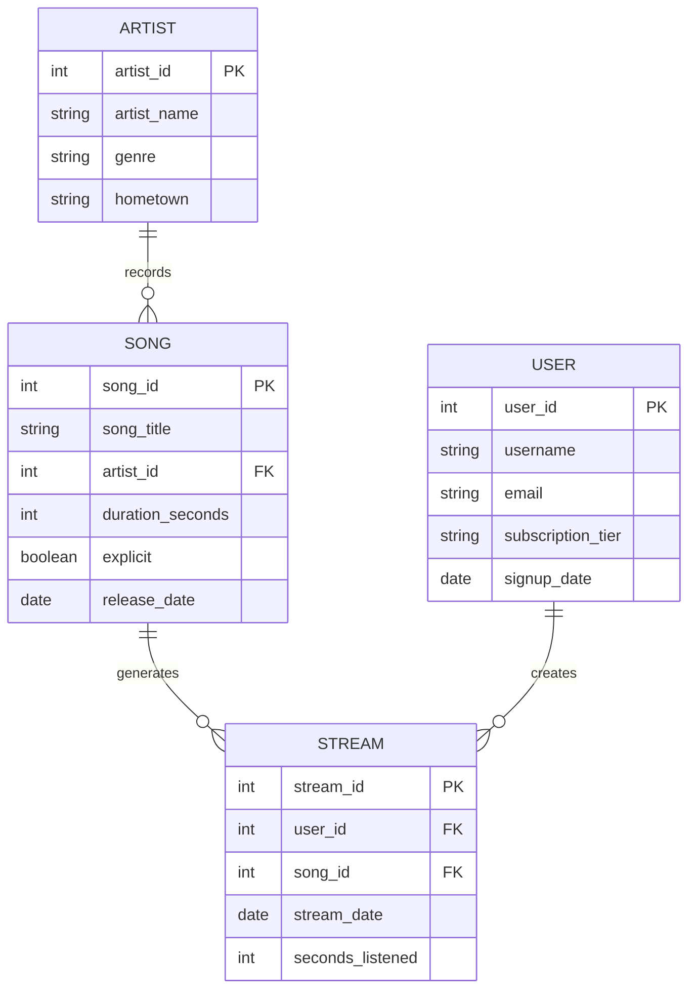

# Chapter 8: Introduction to SQL with AI Assistance

---

Seven chapters in, and SQL is finally here.

If this feels like it took a while to get here, that was intentional. Everything we've covered — entities, relationships, normalization, integrity, query thinking — was preparation for this moment. Because SQL isn't a list of commands to memorize. It's a language for expressing ideas you already have. And the ideas are what matter.

Here's the good news: if you understood Chapter 7, you already understand SQL. The four operations — filter, project, join, aggregate — map directly onto SQL keywords. The pipeline of operations we planned in plain English translates almost word-for-word into SQL syntax. And for the syntax itself, you have a powerful tool: AI assistants that can write correct SQL from a clear description of what you want.

This chapter introduces SQL, teaches you how to use AI to write it effectively, and — most importantly — teaches you how to verify what the AI produces. Because the gap between a student who uses AI well and one who uses it poorly is not technical skill. It's the ability to read a query and know whether it answers the question.

---

## 8.1 What SQL Is and How It Relates to Relational Thinking

### SQL as a language for expressing relational operations

**SQL** stands for Structured Query Language. It's the standard language for communicating with relational databases — asking questions, adding data, changing data, and defining structure. It's been around since the 1970s, it runs on virtually every relational database in the world (PostgreSQL, MySQL, SQLite, SQL Server, Oracle, and more), and it's one of the most durable technical skills you can learn.

But here's what SQL really is: a translation layer between your thinking and the database.

The four operations from Chapter 7 map directly onto SQL's most important keywords:

| Query operation | SQL keyword | What it does |
|----------------|-------------|--------------|
| Project | `SELECT` | Choose which columns to return |
| Filter | `WHERE` | Keep only rows matching a condition |
| Join | `JOIN` | Combine rows from two tables on a shared key |
| Aggregate | `GROUP BY` + aggregate functions | Collapse rows into summaries |

If you can plan a query as a pipeline of these four operations — which you practiced in Chapter 7 — you can read and understand any SQL query. And you can write a prompt that produces correct SQL from an AI on the first try.

### SQL is declarative: you say what you want, not how to get it

Recall from Chapter 4 that the relational model is based on set theory and uses a **declarative** approach: you describe the result you want, not the steps to get there. SQL is the practical implementation of this idea.

Compare these two approaches to the same question — "which artists have more than 50 songs?":

**Procedural (how you'd do it manually):**
1. Go to the Song table.
2. Read through every row.
3. Keep a running count per artist.
4. After reading all rows, check which artists have a count > 50.
5. Return those artists.

**Declarative (SQL):**
```sql
SELECT artist_id, COUNT(*) AS song_count
FROM Song
GROUP BY artist_id
HAVING COUNT(*) > 50;
```

The SQL says *what* you want: artist IDs grouped by artist, where the count exceeds 50. (`GROUP BY` collapses rows into one row per artist; `HAVING` then filters those groups — it's `WHERE` for grouped results. Chapter 9 covers both properly; here they're just showing what declarative looks like.) It says nothing about *how* to find them — no loops, no counters, no manual reading. The database engine figures out the most efficient way to execute it.

This is liberating. You don't need to think about file structures, indexes, or execution order. You just need to express your question correctly, and the database handles the rest.

### Declarative vs. procedural thinking

The shift from procedural to declarative thinking is one of the bigger mental adjustments in learning SQL. Most people's intuition about "how computers work" is procedural — step by step, like a recipe. SQL works differently.

When you write SQL, you're describing a set of results, not a sequence of steps. The database might execute your query in a completely different order than you wrote the clauses. It might scan tables in parallel, use indexes you didn't know existed, or reorder operations for efficiency. That's fine — and in fact, that's the point. The database is better at figuring out "how" than you are.

The practical implication: **don't try to control execution order by how you write SQL.** Write queries that correctly describe what you want, and trust the database to execute them efficiently. When performance matters, there are tools for analyzing and optimizing execution — but that's advanced territory. For now, focus on correctness.

---

## The Schema We'll Use

Throughout this chapter, we'll work with a simplified version of a music streaming service database. Here's the schema:



Four tables. ARTIST records SONG. USER creates STREAM. STREAM references SONG. This is enough to answer a wide range of interesting music questions — and it's the schema we'll use for all the examples in this chapter and the next.

---

## 8.2 Your First Queries: SELECT, FROM, WHERE

### The basic structure of a SQL query

Every SQL query starts with three keywords: `SELECT`, `FROM`, and (usually) `WHERE`. These correspond directly to the project and filter operations from Chapter 7.

```sql
SELECT column1, column2, ...
FROM table_name
WHERE condition;
```

- `SELECT` — which columns do you want? (project)
- `FROM` — which table are you starting from?
- `WHERE` — which rows do you want? (filter)

Let's look at each one.

### SELECT: choosing your columns

`SELECT` is followed by a comma-separated list of the columns you want in the result. This is the projection step — you're choosing which attributes to include in your output.

```sql
SELECT artist_name, genre
FROM Artist;
```

This query returns two columns — `artist_name` and `genre` — for every row in the Artist table. No filter, so all artists are returned.

You can also use `SELECT *` to return all columns:

```sql
SELECT *
FROM Artist;
```

This is convenient for exploration, but in production queries, always specify the columns you need. `SELECT *` returns everything — including columns you didn't ask for, sensitive data you shouldn't expose, and future columns that might get added to the table and break your application.

You can also rename columns in the output using `AS`:

```sql
SELECT artist_name AS name, genre AS music_type
FROM Artist;
```

The result has columns named `name` and `music_type` instead of `artist_name` and `genre`. This is useful for making output readable, especially when column names are technical or ambiguous.

### FROM: specifying the table

`FROM` is followed by the name of the table you're querying. For single-table queries, this is straightforward. When joins are involved, `FROM` is where you start, and `JOIN` clauses follow. You'll also see a short name written right after a table — `FROM User u` — which is a **table alias**: a nickname for that table within this one query, so later references can be shortened to `u.subscription_tier` instead of `User.subscription_tier`. AI assistants use aliases constantly, so it's worth being able to read them before you write them.

### WHERE: filtering rows

`WHERE` is followed by a condition. Only rows where the condition is true are included in the result.

```sql
SELECT artist_name, genre
FROM Artist
WHERE genre = 'Hip-Hop';
```

This returns only artists whose genre is exactly "Hip-Hop."

### WHERE conditions: comparison operators, AND, OR, NOT

SQL supports a full range of conditions:

**Equality and inequality:**
```sql
WHERE genre = 'Pop'          -- exactly equal
WHERE duration_seconds > 240  -- greater than 4 minutes
WHERE release_date >= '2024-01-01'  -- on or after this date
WHERE explicit != true        -- not explicit
```

**Range:**
```sql
WHERE duration_seconds BETWEEN 180 AND 240  -- between 3 and 4 minutes
WHERE release_date BETWEEN '2024-01-01' AND '2024-12-31'  -- all of 2024
```

**Membership:**
```sql
WHERE genre IN ('Pop', 'R&B', 'Hip-Hop')  -- any of these genres
WHERE artist_id IN (101, 204, 388)         -- specific artists
```

**Pattern matching:**
```sql
WHERE artist_name LIKE 'The %'   -- starts with "The "
WHERE song_title LIKE '%Love%'   -- contains "Love" anywhere
```

**Combining conditions:**
```sql
WHERE genre = 'Pop' AND release_date >= '2024-01-01'  -- both must be true
WHERE genre = 'Pop' OR genre = 'R&B'                  -- either is fine
WHERE NOT explicit                                     -- exclude explicit songs
```

**Checking for null:**
```sql
WHERE hometown IS NULL     -- no hometown recorded
WHERE hometown IS NOT NULL -- hometown is known
```

Here's a complete example: songs that are pop, released in 2024, under 3 minutes long, and not explicit:

```sql
SELECT song_title, duration_seconds, release_date
FROM Song
WHERE genre = 'Pop'
  AND release_date BETWEEN '2024-01-01' AND '2024-12-31'
  AND duration_seconds < 180
  AND explicit = false;
```

Notice the formatting: each condition is on its own line, indented under `WHERE`. SQL doesn't care about whitespace — you could write this all on one line — but readable formatting is a professional habit worth developing early.

### Basic SELECT syntax and common mistakes

A few mistakes beginners make consistently:

**Forgetting quotes around text values.** In SQL, text values (strings) need single quotes. `WHERE genre = Pop` won't work; it needs to be `WHERE genre = 'Pop'`. Numbers don't need quotes: `WHERE duration_seconds > 240`.

**Using = instead of IS NULL.** You can't write `WHERE hometown = NULL` — it won't work the way you expect. NULL requires `IS NULL` or `IS NOT NULL`.

**Confusing AND and OR.** `WHERE genre = 'Pop' AND genre = 'Hip-Hop'` will return zero rows — no song can be both genres simultaneously. What you probably want is `WHERE genre IN ('Pop', 'Hip-Hop')` or `WHERE genre = 'Pop' OR genre = 'Hip-Hop'`.

**Case sensitivity.** Depending on the database, string comparisons may or may not be case-sensitive. `WHERE genre = 'pop'` might not match rows where genre is stored as "Pop." Know your database's behavior.

### Reading query results critically

Getting a query to run without errors is not the same as getting the right answer. Before you trust a result, ask:

**Does the row count make sense?** If you're querying for pop artists and you get 47,000 rows, that's probably wrong — either your filter is too broad or you've accidentally created a Cartesian product. If you get 0 rows, your filter might be too strict.

**Does one row represent what you expect it to?** If the grain should be "one row per artist" but you're seeing multiple rows for the same artist, something is wrong — probably a join that's producing duplicates.

**Spot-check a few rows against known facts.** Pick an artist you know exists and verify their rows look right. Pick an artist in a genre you're filtering out and make sure they don't appear.

**Does the total make sense?** If you're summing revenue and the total is negative or billions of dollars, something is wrong. Sanity-check aggregated results against reasonable expectations.

These checks take 30 seconds and catch the majority of query errors. Make them a habit.

---

## 8.3 Using AI to Write SQL

### The AI as a syntax translator

Here's the course's core position on AI and SQL: **AI is excellent at syntax. You are responsible for thinking.**

An AI assistant can take a clear description of what you want and produce correct SQL almost instantly. It knows every SQL keyword, every function, every edge case of syntax. What it doesn't know is your data, your business, or whether the question you asked is actually the question you meant to ask.

This division of labor is powerful — but it only works if you hold up your end. If you give the AI a vague or imprecise description, you'll get SQL that's syntactically correct but semantically wrong. If you can't evaluate the SQL the AI produces, you'll trust answers that are incorrect.

The skills this course is building — understanding the relational model, thinking in operations, planning queries before writing them — are precisely the skills that make you an effective AI user for data work.

### How to prompt an AI assistant effectively

The single most important thing you can do to get good SQL from an AI is to give it the schema. The AI cannot guess your table names, column names, or relationships. Without the schema, it will invent plausible-sounding table and column names that might not match your actual database.

A minimal prompt has three parts:

1. **The schema** — table names, column names, and key relationships
2. **The business question** — stated precisely in plain English
3. **Any constraints or preferences** — which database (MySQL, PostgreSQL, SQLite?), any specific formatting preferences

Here's what a weak prompt looks like:

> *"Write me a SQL query to find popular songs."*

This is almost useless. What database? What tables? What does "popular" mean — most streams? Most saves? Most playlist adds? Over what time period?

Here's what a strong prompt looks like:

> *"I'm using a PostgreSQL database with the following schema:*
>
> *ARTIST (artist_id PK, artist_name, genre, hometown)*
> *SONG (song_id PK, song_title, artist_id FK, duration_seconds, explicit, release_date)*
> *USER (user_id PK, username, email, subscription_tier, signup_date)*
> *STREAM (stream_id PK, user_id FK, song_id FK, stream_date, seconds_listened)*
>
> *Write a query that returns the song title and total stream count for every song that was streamed more than 10,000 times in the month of March 2026. Sort the results by stream count descending."*

The strong prompt tells the AI exactly what tables exist, what columns they have, what you want to know, what filter to apply, and how to sort the result. The AI has everything it needs to produce correct SQL on the first try.

### Providing schema context: table names, column names, relationships

When providing schema context, you don't need to give the AI your entire database. Give it the tables relevant to the query. If the question is about streams and songs, include STREAM and SONG. If the question also needs artist names, include ARTIST. Leave out tables that aren't involved.

You can describe the schema in a few different ways:

**Column list format** (quick, works well for simple schemas):
```
SONG (song_id PK, song_title, artist_id FK, duration_seconds, explicit, release_date)
```

**CREATE TABLE format** (more detailed, useful for complex queries):
```sql
CREATE TABLE Song (
    song_id INTEGER PRIMARY KEY,
    song_title VARCHAR(255),
    artist_id INTEGER REFERENCES Artist(artist_id),
    duration_seconds INTEGER,
    explicit BOOLEAN,
    release_date DATE
);
```

Either works. The key is that the AI can see the column names and understand the foreign key relationships.

### Being specific about the business question, not the SQL you expect

A common mistake is to describe the SQL you think you want rather than the business question you're trying to answer. This leads to the AI confirming your syntax rather than solving your problem — and if your mental model of the query is wrong, the AI will write wrong SQL that "looks right" to you.

Instead, describe the business question as clearly as possible, and let the AI figure out the SQL.

**Less effective (describes SQL):**
> *"Join the Stream table to the Song table and group by artist_id to get a count."*

**More effective (describes the question):**
> *"I want to know how many times each artist's songs have been streamed in total. Give me artist name and total stream count, sorted by most streamed first."*

The second version is more likely to produce correct SQL because the AI can reason about whether its output actually answers the question. The first version just instructs the AI to execute a particular SQL pattern — which might not be the right pattern for what you actually need.

### The anatomy of a good SQL prompt

Putting it all together, here's a template for an effective SQL prompt:

```
I'm working with [database type, e.g., PostgreSQL / SQLite / MySQL].

Here is the relevant schema:
[table name] ([column list with PK/FK noted])
[table name] ([column list with PK/FK noted])
...

I want to know: [business question, stated precisely]

Additional constraints:
- [any filters: time period, specific values, etc.]
- [output format: sort order, column names, etc.]
- [anything to exclude or be careful about]
```

Let's write a complete prompt using this template:

---

*I'm working with SQLite.*

*Relevant schema:*
*ARTIST (artist_id PK, artist_name, genre, hometown)*
*SONG (song_id PK, song_title, artist_id FK, duration_seconds, explicit, release_date)*
*STREAM (stream_id PK, user_id FK, song_id FK, stream_date, seconds_listened)*

*I want to know: For each genre, what is the average song duration in minutes (not seconds), and how many songs exist in that genre? Only include genres that have at least 10 songs. Sort by average duration descending.*

*Additional constraints:*
*- Return genre, avg_duration_minutes (rounded to 2 decimal places), and song_count.*
*- Exclude explicit songs from the calculation.*

---

This prompt is specific enough that any capable AI should produce correct SQL on the first try.

### Iterating with the AI when the first result is wrong

Sometimes the first result isn't quite right. This is normal and expected. The right response is to iterate — describe what's wrong and ask the AI to revise.

Effective iteration prompts are specific about what's wrong:

**Vague (not helpful):**
> *"That's not right. Try again."*

**Specific (helpful):**
> *"The query is returning one row per stream rather than one row per genre. I need the results grouped by genre, not by individual stream. Can you fix the GROUP BY clause?"*

Or:

> *"The average duration is coming back in seconds (around 200), but I asked for minutes. Can you add the conversion — divide by 60 — and round to 2 decimal places?"*

Being specific about the error helps the AI fix the right thing. It also requires you to understand enough about what the query is doing to articulate what's wrong — which is exactly the conceptual fluency this course is building.

---

## 8.4 Verifying AI-Generated SQL

### Why conceptual fluency is required to catch AI mistakes

AI tools are remarkably good at SQL. They are not perfect. And their mistakes are often invisible to someone who doesn't understand the underlying relational concepts.

An AI doesn't know your data. It knows SQL syntax and general patterns. It will produce SQL that looks right — that runs without errors, that returns results — even when it's answering a subtly different question than the one you asked. And because the output is plausible-looking numbers, not error messages, the mistake can travel all the way to a business decision before anyone catches it.

Here are the most common AI failure modes:

**Wrong join type.** The AI uses an INNER JOIN when you needed a LEFT JOIN (or vice versa), silently dropping rows you needed to keep — or including rows you needed to exclude. (An INNER JOIN returns only rows that match in both tables; a *LEFT JOIN* returns every row from the first table whether or not it has a match, leaving the missing side empty. That difference is what lets you ask "which songs have *never* been streamed?" — Chapter 9 covers both properly.)

**Missing filter.** You asked about "last month" but the AI forgot the date filter, returning all-time results. The numbers look reasonable, so you don't notice.

**Wrong aggregation level.** You asked how many *users* did something, but the AI counted *events* (streams, clicks, purchases). The result is a number, but it's the wrong number for the wrong thing.

**Incorrect grain.** The AI writes a query whose result has one row per stream rather than one row per song. If you then aggregate again, you get wrong totals.

**Invented column names.** The AI assumes a column called `play_count` exists when your table actually has a `seconds_listened` column. The query fails with an error — but this is actually the best outcome, because at least you know something is wrong.

**Plausible but wrong logic.** "Songs with more than average streams" — the AI calculates the average correctly but compares it against the wrong thing (maybe the average per artist rather than the overall average).

None of these mistakes are obvious from looking at the SQL if you don't understand what the SQL is doing. They become obvious if you do.

### The AI doesn't know your data — it knows syntax

This is the central limitation to keep in mind. When you describe your schema to an AI, it learns the structure of your data — the table names, column names, and relationships. But it has no idea what the actual values look like. It doesn't know that your `genre` column stores "Hip-Hop" with a capital H and a hyphen (not "hip hop" or "hiphop"). It doesn't know that some `stream_date` values are stored in UTC and some in local time. It doesn't know that a legacy import put bad data in rows 50,000 through 75,000.

This means the AI can write syntactically correct SQL that produces wrong results because of data quality issues it can't see. Your knowledge of the data — knowing its quirks, its gaps, its anomalies — is something you bring to the table that the AI cannot.

### A checklist for reviewing queries you didn't write

Use this checklist every time you receive SQL from an AI (or from anyone else):

**1. Does the FROM clause include all the tables needed to answer the question?**
List the tables in the query. Are they the right tables? Are any missing?

**2. Is every join condition correct and complete?**
For each JOIN, check: is it joining on the right keys? Is the join type (INNER, LEFT, etc.) appropriate for the question?

**3. Does the WHERE clause match the question's filters?**
If the question asked for "last month," is there a date filter? Is it the right date range? Are there any filters that shouldn't be there?

**4. Does the result grain match what you asked for?**
What does one row in the result represent? Is that the right grain for the question? If you asked for one row per artist but the query returns one row per song, something is wrong.

**5. Is the aggregation correct?**
If the query uses GROUP BY, what is it grouping by? Is that the right grouping? Are the aggregate functions (COUNT, SUM, AVG) computing the right things?

**6. Does the SELECT clause return exactly what you need?**
Are there extra columns you didn't ask for? Are there columns you needed that are missing? Are calculated columns (like duration in minutes) computed correctly?

**7. Run a sanity check on the result.**
Does the row count seem right? Does the total seem reasonable? Spot-check a few known values against the result.

This checklist takes two minutes to run through. It catches the majority of AI SQL errors before they become business mistakes.

### Putting it together: a worked example

Let's trace through a complete cycle: business question → AI prompt → SQL output → verification.

**Business question:** "Which subscription tier has the highest average listening session length, in minutes?"

**Planning the query (Chapter 7 style):**
- Grain of result: one row per subscription tier
- Tables needed: USER (for subscription_tier), STREAM (for seconds_listened)
- Join: USER joined to STREAM on user_id
- Aggregation: average of seconds_listened, grouped by subscription_tier; divide by 60 for minutes
- Sort: descending by average

**AI prompt:**
*"SQLite database. Schema: USER (user_id PK, username, email, subscription_tier, signup_date), STREAM (stream_id PK, user_id FK, song_id FK, stream_date, seconds_listened). Question: Which subscription tier has the highest average listening session length? Return subscription_tier and avg_session_minutes (average of seconds_listened divided by 60, rounded to 2 decimal places). Sort by avg_session_minutes descending."*

**AI output:**
```sql
SELECT
    u.subscription_tier,
    ROUND(AVG(s.seconds_listened) / 60.0, 2) AS avg_session_minutes
FROM User u
JOIN Stream s ON u.user_id = s.user_id
GROUP BY u.subscription_tier
ORDER BY avg_session_minutes DESC;
```

**Verification checklist:**

1. ✅ FROM clause has USER and STREAM — the right tables.
2. ✅ JOIN is on `u.user_id = s.user_id` — correct key, INNER JOIN (appropriate here: we only want users who have streams).
3. ✅ No WHERE filter — correct, we want all time periods.
4. ✅ Grain: one row per subscription_tier — correct.
5. ✅ GROUP BY subscription_tier — correct grouping. AVG of seconds_listened — correct function.
6. ✅ SELECT returns subscription_tier and avg_session_minutes — exactly what was asked. Division by 60.0 (not 60) ensures decimal result. ROUND to 2 places — correct.
7. Sanity check: results show tiers "Basic," "Pro," "Elite" — those are the expected tiers. Averages are around 3–8 minutes — plausible for listening sessions. ✅

This query passes the checklist. You can trust the result.

---

## Chapter Summary

SQL is a declarative language for expressing relational queries. It maps directly onto the four operations from Chapter 7: SELECT handles projection, WHERE handles filtering, JOIN handles joining, and GROUP BY with aggregate functions handles aggregation. If you can plan a query as a pipeline of operations, you can understand any SQL query and write prompts that produce correct SQL from an AI.

The basic SELECT-FROM-WHERE structure handles most single-table queries. SELECT specifies columns, FROM specifies the table, and WHERE filters rows using conditions involving equality, ranges, membership, patterns, and boolean logic.

AI assistants are powerful syntax translators for SQL, but they require clear, specific prompts to produce correct results. Effective prompts include the relevant schema, a precisely stated business question, and any specific constraints. When AI output is wrong, iterate with specific descriptions of what's incorrect.

Verifying AI-generated SQL requires conceptual fluency — understanding what the query is trying to do well enough to check whether it actually does it. The verification checklist covers tables, join conditions, filters, result grain, aggregation, and output columns. A two-minute checklist prevents business decisions based on wrong data.

---

## Key Terms

**SQL (Structured Query Language)** — The standard language for interacting with relational databases. Declarative: describes what you want, not how to get it.

**SELECT** — The SQL clause that specifies which columns to include in the result (projection).

**FROM** — The SQL clause that specifies the table (or tables, with joins) to query.

**WHERE** — The SQL clause that filters rows based on a condition.

**AS** — SQL keyword for renaming a column or expression in the query result (aliasing a column, not a table).

**Table alias** — A short name given to a table in FROM or JOIN (`FROM User u`), used to qualify column references elsewhere in the same query.

**Aggregate functions** — Functions that compute a single value from a set of rows: COUNT, SUM, AVG, MIN, MAX.

**Schema context** — The table and column information provided to an AI assistant so it can write SQL for your specific database.

---

## Interactive Activities

The activities below are designed to be completed with a generative AI tool such as Claude (claude.ai) or ChatGPT. For each activity, copy the prompt in the gray box and paste it directly into your AI tool to begin an interactive study session.

---

### Activity 8.1 — Concept Check: SQL and Relational Thinking

*This activity checks your understanding of the key ideas from Chapter 8. The AI will quiz you one question at a time, give feedback, and help fill in any gaps.*

---

**Copy and paste this prompt into your AI tool:**

> I've just finished reading Chapter 8 of my Introduction to Databases textbook, which introduced SQL and how to use AI tools to write and verify queries. I want to check my understanding. Please quiz me by asking the following questions one at a time. Wait for my answer before moving on. After each answer, tell me what I got right, correct anything I misunderstood, and explain it more clearly if needed. Then ask if I'd like to go deeper before moving to the next question.
>
> Here are the questions:
>
> - How do the four relational operations from the previous chapter (filter, project, join, aggregate) map onto SQL keywords?
> - What does it mean for SQL to be "declarative"? How is that different from a procedural approach?
> - What does SELECT * do, and why is it usually a bad idea in production queries?
> - What is the difference between WHERE and HAVING? When would you use each one?
> - What are three common mistakes beginners make when writing WHERE conditions?
> - What are the three essential parts of a good AI prompt for generating SQL?
> - What is the most common reason AI-generated SQL is wrong even though it runs without errors?
> - Walk me through the verification checklist for AI-generated SQL — what are the key things to check?
> - What does it mean to "sanity check" a query result? Give an example of a sanity check you might run.
> - What is a table alias? Why do AI-generated queries use them so heavily, and what do you need to watch for when reading one?

---

### Activity 8.2 — Apply It: Write AI Prompts for Real Questions

*This activity gives you practice writing high-quality SQL prompts — the core skill for using AI effectively as a data analyst. The AI will evaluate your prompts and help you improve them.*

---

**Copy and paste this prompt into your AI tool:**

> I'm studying how to use AI tools to write SQL in my Introduction to Databases class. I want to practice writing effective SQL prompts. My textbook says a good prompt has three parts: the schema, the precise business question, and any constraints.
>
> I'll give you a schema and a list of business questions. For each question, I'll write a prompt as if I were asking an AI assistant to write the SQL for me. You evaluate my prompt: tell me what's strong about it, what's weak or missing, and give me a revised version that would produce better SQL. Do them one at a time and wait for my attempt before giving feedback.
>
> Here's the schema:
>
> ARTIST (artist_id PK, artist_name, genre, hometown)
> SONG (song_id PK, song_title, artist_id FK, duration_seconds, explicit, release_date)
> USER (user_id PK, username, email, subscription_tier, signup_date)
> STREAM (stream_id PK, user_id FK, song_id FK, stream_date, seconds_listened)
>
> Here are the business questions — for each one, I'll write my prompt attempt and you give feedback:
>
> 1. "How many songs does each artist have?"
> 2. "Which users streamed music yesterday?"
> 3. "What is the most streamed song of all time?"
> 4. "Which genres are most popular among Premium subscribers?"
> 5. "How many new users signed up each month this year?"
>
> After we've gone through all five, tell me the two or three most important habits I should build to write better SQL prompts consistently.

---

### Activity 8.3 — Practice: Read and Verify SQL

*This activity builds your ability to read SQL written by someone else — or an AI — and identify whether it correctly answers the stated question. This is the most important verification skill in the chapter.*

---

**Copy and paste this prompt into your AI tool:**

> I'm learning to verify SQL queries in my Introduction to Databases class. I want to practice reading queries and deciding whether they correctly answer a given business question.
>
> Here is the schema I'm working with:
>
> ARTIST (artist_id PK, artist_name, genre, hometown)
> SONG (song_id PK, song_title, artist_id FK, duration_seconds, explicit, release_date)
> USER (user_id PK, username, email, subscription_tier, signup_date)
> STREAM (stream_id PK, user_id FK, song_id FK, stream_date, seconds_listened)
>
> Please present the following question-and-query pairs to me one at a time. For each one, ask me: (a) Does this query correctly answer the question? (b) If not, what is wrong with it? (c) How would you fix it?
>
> Wait for my answer each time. Tell me if I'm right, explain what I missed, and show me the corrected version if needed.
>
> Pair 1:
> Question: "How many distinct users streamed music last month (June 2026)?"
> Query:
> SELECT COUNT(*) AS stream_count
> FROM Stream
> WHERE stream_date BETWEEN '2026-06-01' AND '2026-06-30';
>
> Pair 2:
> Question: "What are the names of artists who have released at least one explicit song?"
> Query:
> SELECT DISTINCT a.artist_name
> FROM Artist a
> JOIN Song s ON a.artist_id = s.artist_id
> WHERE s.explicit = true;
>
> Pair 3:
> Question: "What is the average stream duration in minutes for each subscription tier?"
> Query:
> SELECT subscription_tier, AVG(seconds_listened) AS avg_minutes
> FROM User
> JOIN Stream ON User.user_id = Stream.user_id
> GROUP BY subscription_tier;
>
> Pair 4:
> Question: "Which songs have never been streamed?"
> Query:
> SELECT song_title
> FROM Song
> JOIN Stream ON Song.song_id = Stream.song_id
> WHERE Stream.stream_id IS NULL;
>
> Pair 5:
> Question: "For each genre, what percentage of songs are explicit?"
> Query:
> SELECT genre,
>        COUNT(*) AS total_songs,
>        SUM(CASE WHEN explicit = true THEN 1 ELSE 0 END) AS explicit_count
> FROM Song
> GROUP BY genre;
>
> After we've gone through all five, ask me to write a correct version of the query that was hardest for me to evaluate.

---

### Activity 8.4 — Case Study: Full Cycle from Question to Verified Query

*This activity walks you through the complete workflow: receive a business question, write an AI prompt, get SQL back, verify it using the checklist. The AI plays the role of both the stakeholder and the AI assistant.*

---

**Copy and paste this prompt into your AI tool:**

> I want to practice the full SQL workflow my Introduction to Databases textbook teaches: (1) understand the business question, (2) plan the query as a pipeline, (3) write a good AI prompt, (4) receive SQL, (5) verify it with the checklist.
>
> Please run this as an interactive exercise. You'll play two roles: first, a product manager asking me data questions; then, an AI assistant responding to my SQL prompts. I play the data analyst in the middle.
>
> Here is the schema:
>
> ARTIST (artist_id PK, artist_name, genre, hometown)
> SONG (song_id PK, song_title, artist_id FK, duration_seconds, explicit, release_date)
> USER (user_id PK, username, email, subscription_tier, signup_date)
> STREAM (stream_id PK, user_id FK, song_id FK, stream_date, seconds_listened)
>
> Run this cycle three times with these business questions:
>
> Question 1: "I want to reward our most engaged users. Who are the top 10 users by total listening time this year, and how many hours have they listened?"
>
> Question 2: "We're thinking about removing short songs from the platform. How many songs are under 90 seconds, and which artists have the most of them?"
>
> Question 3: "I need to understand listening drop-off. For each song, what percentage of streams lasted at least 80% of the song's duration?"
>
> For each question, here's the process:
> - First, acting as the product manager, present the question and ask me to plan the query pipeline in plain English before touching SQL.
> - Give me feedback on my plan.
> - Then ask me to write the AI prompt I would use to get the SQL.
> - Switch to playing the AI assistant: respond to my prompt with a SQL query.
> - Switch back to being my instructor: walk me through the verification checklist and tell me whether the SQL is correct.
>
> After all three cycles, give me an overall assessment: what part of this workflow am I strongest at, and what should I practice more?
