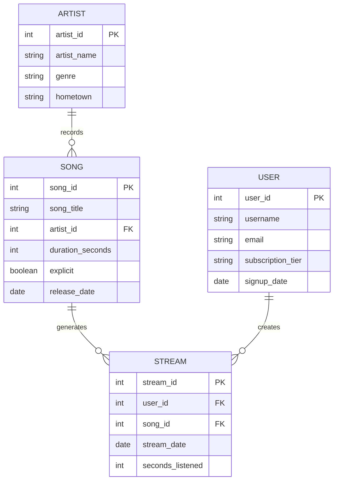

# Chapter 9: Joins and Aggregation

---

In Chapter 8 you wrote your first SQL queries. You can now filter rows with WHERE, choose columns with SELECT, and get results from a single table. That's a solid foundation — but most real business questions can't be answered from a single table.

"Which artists have the most streams?" — that requires joining Song to Stream to Artist.
"Which genres generate the most revenue?" — that requires joining through multiple tables and then aggregating.
"Which songs have never been played?" — that requires a join that deliberately keeps unmatched rows.

Joins and aggregation are where relational databases become genuinely powerful. They're also where most SQL errors happen. This chapter goes deep on both — not just the syntax, but the thinking behind it. By the end, you'll understand why a join works the way it does, when to use which type, and how to catch the subtle errors that AI tools make most often.

We'll continue using the music streaming schema from Chapter 8:



---

## 9.1 Why Joins Are the Heart of Relational Thinking

### Normalization splits data apart; joins bring it back together

Think about what we did in Chapters 5 and 6. We took a messy, redundant table and split it into clean, focused ones — artist information in its own table, song information in its own table, stream records in their own table. We did this to eliminate redundancy and prevent anomalies.

But now someone asks: "Which artist recorded the most-streamed song this month?"

The answer requires information from three different tables: Artist (for the artist's name), Song (to connect streams to artists), and Stream (for the count). We split them apart for good reasons — and now we need to bring them back together to answer the question.

Joins are how you put it back together. They're not a workaround for the limitations of normalization. They're the intended mechanism — the other half of the design. You normalize to store data cleanly. You join to query it flexibly. The two work together.

This is one of the most important things to understand about relational databases: **normalization and joins are a pair.** Normalization without the ability to join would make data impossible to use. Joins without normalization would require duplicating data everywhere to make them work. Together, they give you the best of both worlds: clean storage and flexible querying.

### The join is not a workaround — it's the design

Beginners sometimes treat joins as a necessary evil — something complicated they have to do because the data is "spread across multiple tables." This framing gets it backwards.

The data is in multiple tables because that's the right design. The join is the right tool for combining it. When you write a JOIN, you're not working around the database structure — you're using it exactly as intended.

The analogy: when you look up a word in a dictionary, you don't complain that the definition isn't printed next to every sentence where that word appears. You look it up once. Relational databases work the same way. Data lives in one place (normalized tables), and you retrieve it with a lookup (a join) when you need it. The lookup isn't a workaround; it's the mechanism.

### What happens when you join incorrectly

Before we see how joins work, let's look at what happens when they go wrong. There are two classic failure modes.

**The Cartesian product**, which we met in Chapter 7, happens when you join two tables without a join condition — or with a wrong one. Instead of matching rows on a shared key, the database produces every possible combination of rows from both tables.

Imagine joining a table of 1,000 songs to a table of 10,000 streams with no join condition. The result: 1,000 × 10,000 = 10,000,000 rows, nearly all of them meaningless. The query might run for a long time, return an enormous result, and look superficially like data — but it's wrong.

This is one of the most damaging mistakes in SQL because it's silent. No error message. Just a massive, wrong result that looks like it might be right.

**Fan traps** happen when you join multiple one-to-many relationships from the same table and then try to aggregate. For example, if an Artist has many Songs *and* many Concerts, joining all three tables and then summing revenue will produce inflated numbers — because each Concert row gets "multiplied" by the number of Songs for that Artist, and vice versa. We'll see a concrete example of this later in the chapter.

**Chasm traps** happen when the join path goes through a table that might not have matching rows for every combination, silently dropping data you expected to keep. The fix is usually a different join type — which we'll cover next.

---

## 9.2 Types of Joins

SQL supports several join types, but two cover the vast majority of real queries: INNER JOIN and LEFT JOIN. Understanding the difference is one of the most important SQL skills you'll develop.

### INNER JOIN: only matching rows

An **INNER JOIN** returns rows only where a match exists in *both* tables. If a row in the left table has no corresponding row in the right table, it's excluded from the result. If a row in the right table has no corresponding row in the left table, it's also excluded.

Let's see this with a small example. Suppose we have:

**Song table (excerpt):**
| song_id | song_title | artist_id |
|---------|-----------|-----------|
| 1 | Espresso | 10 |
| 2 | Cruel Summer | 11 |
| 3 | Paint the Town Red | 12 |

**Stream table (excerpt):**
| stream_id | song_id | stream_date |
|-----------|---------|-------------|
| 101 | 1 | 2026-03-15 |
| 102 | 1 | 2026-03-16 |
| 103 | 2 | 2026-03-17 |

Notice: Song 3 ("Paint the Town Red") has no streams yet.

**INNER JOIN result:**
```sql
SELECT s.song_title, st.stream_date
FROM Song s
INNER JOIN Stream st ON s.song_id = st.song_id;
```

| song_title | stream_date |
|-----------|-------------|
| Espresso | 2026-03-15 |
| Espresso | 2026-03-16 |
| Cruel Summer | 2026-03-17 |

"Paint the Town Red" is gone. It has no matching rows in the Stream table, so INNER JOIN silently drops it.

This behavior is correct when you only care about songs that have been streamed. But if you're trying to answer "how many streams does each song have, including songs with zero streams?" — INNER JOIN gives you the wrong answer, because it drops those songs entirely rather than returning a zero count.

### When unmatched rows should be excluded

INNER JOIN is the right choice when the question only makes sense for matching rows:

- "What song was playing when this stream happened?" — A stream must have a matching song. No match means bad data; excluding it is correct.
- "Which artists recorded songs that were streamed last month?" — You only want artists whose songs appear in the stream data. No streams = not in the result, and that's fine.
- "What is the average session length per song?" — Songs with no sessions have no average; excluding them makes sense.

The test: would including a row with no match produce a meaningful result? If not, INNER JOIN is right.

### The risk: silently dropping data you wanted

The risk of INNER JOIN is that it drops data silently. You won't get an error. You won't get a warning. You'll just get fewer rows than you expected — and if you don't know to expect a certain number, you might not notice.

This is why the row count sanity check from Chapter 8's verification checklist is so important. "I'm querying songs joined to streams. We have 50,000 songs in the database. My result has 30,000 rows. That means 20,000 songs have no streams — is that expected?" If 20,000 unstreamed songs is surprising, your join type might be wrong.

When in doubt, start with a LEFT JOIN and verify the results. You can always tighten to an INNER JOIN once you understand what's being excluded.

### LEFT JOIN: all rows from one side, matches from the other

A **LEFT JOIN** (also called LEFT OUTER JOIN) returns all rows from the left table, and matching rows from the right table where they exist. When there's no match in the right table, the right table's columns appear as NULL in the result.

Using the same example:

```sql
SELECT s.song_title, st.stream_date
FROM Song s
LEFT JOIN Stream st ON s.song_id = st.song_id;
```

| song_title | stream_date |
|-----------|-------------|
| Espresso | 2026-03-15 |
| Espresso | 2026-03-16 |
| Cruel Summer | 2026-03-17 |
| Paint the Town Red | NULL |

Now "Paint the Town Red" appears — with NULL in `stream_date` because it has no streams. The song wasn't dropped; it was preserved with a null to indicate the absence of a match.

This is powerful for questions like:
- "Which songs have never been streamed?" — Filter the LEFT JOIN result for `stream_date IS NULL`
- "How many streams does each song have, including songs with zero streams?" — GROUP BY song, COUNT streams, and songs with no streams will have a count of 0
- "Which students haven't bought a ticket yet?" — LEFT JOIN students to tickets, filter for NULL ticket

### NULLs in the result and what they mean

When a LEFT JOIN produces a NULL in a right-table column, it means: "this left-table row had no matching row in the right table." NULL doesn't mean zero. NULL means unknown, or in this context, absent.

This distinction matters enormously for aggregation. If you do `COUNT(stream_date)` on a LEFT JOIN result, songs with no streams get a count of 0 — because COUNT ignores NULLs. But if you do `COUNT(*)`, it counts all rows including the unmatched ones, and you'll need to handle the NULLs yourself.

We'll come back to NULL behavior in aggregation in section 9.3.

### When to use which, and why it matters

The choice between INNER JOIN and LEFT JOIN comes down to one question: **do I need to keep rows that have no match?**

| Question type | Join to use |
|--------------|-------------|
| "Which A's have at least one B?" | INNER JOIN |
| "For each A, how many B's does it have (including zero)?" | LEFT JOIN |
| "Which A's have no B's?" | LEFT JOIN, then filter WHERE B.key IS NULL |
| "Combine A and B where both exist" | INNER JOIN |
| "Show all A's, with B's where they exist" | LEFT JOIN |

A quick rule of thumb: **if you care about the "missing" cases, use LEFT JOIN.** If you only care about where both sides have data, use INNER JOIN.

### Testing join type choices with small, known datasets

The most reliable way to verify you've chosen the right join type is to test with a small dataset where you know exactly what the result should be.

Before running a query on your full database of 10 million rows, run it on a sample of 20 rows where you can manually verify the output. If you expect 15 songs but only 12 come back, something is being dropped — probably by an INNER JOIN where you needed LEFT JOIN. If you expect 15 rows but get 45, you might have a Cartesian product or a fan trap.

Small-dataset testing takes two minutes and catches most join errors before they affect real analysis.

### Multi-table joins

Real queries often need to join three or more tables. Each JOIN adds another connection in the chain.

Here's a three-table join to get artist names alongside stream data:

```sql
SELECT
    a.artist_name,
    s.song_title,
    st.stream_date
FROM Stream st
INNER JOIN Song s ON st.song_id = s.song_id
INNER JOIN Artist a ON s.artist_id = a.artist_id
WHERE st.stream_date >= '2026-03-01';
```

The join path here is: Stream → Song (via `song_id`) → Artist (via `artist_id`). Each join follows a foreign key relationship, exactly as we traced join paths in Chapter 7.

The order of JOINs in SQL doesn't affect correctness — the database engine optimizes the execution order — but for readability, it's common to start with the most specific table (Stream) and join outward toward the reference tables (Song, Artist).

### Fan traps: when joins multiply rows

A **fan trap** is a subtle error that produces inflated aggregation results. It happens when you join through a table that sits at the "one" end of two different one-to-many relationships, and then try to aggregate across both.

Here's a concrete example. Suppose we add a `PlaylistSong` table to our schema — songs can be added to playlists, and we want to know, for each artist, their total stream count AND total playlist adds.

A naive approach:

```sql
-- This is WRONG
SELECT
    a.artist_name,
    COUNT(st.stream_id) AS stream_count,
    COUNT(ps.playlist_id) AS playlist_add_count
FROM Artist a
JOIN Song s ON a.artist_id = s.artist_id
JOIN Stream st ON s.song_id = st.song_id
JOIN PlaylistSong ps ON s.song_id = ps.song_id
GROUP BY a.artist_name;
```

The problem: for each song, there are multiple streams AND multiple playlist adds. When you join all three tables together, each stream row gets combined with each playlist add row for the same song. A song with 100 streams and 50 playlist adds produces 100 × 50 = 5,000 rows in the joined result — far more than either count alone.

When you then COUNT streams and playlist adds, you get wildly inflated numbers. And because the numbers are large and non-zero, they look plausible. This is one of the most dangerous errors in SQL because it's hard to catch without already knowing the correct answer.

The fix is to aggregate each relationship separately before joining:

```sql
-- Correct approach: aggregate each side independently
SELECT
    a.artist_name,
    COALESCE(sc.stream_count, 0) AS stream_count,
    COALESCE(pa.playlist_add_count, 0) AS playlist_add_count
FROM Artist a
LEFT JOIN (
    SELECT s.artist_id, COUNT(*) AS stream_count
    FROM Song s
    JOIN Stream st ON s.song_id = st.song_id
    GROUP BY s.artist_id
) sc ON a.artist_id = sc.artist_id
LEFT JOIN (
    SELECT s.artist_id, COUNT(*) AS playlist_add_count
    FROM Song s
    JOIN PlaylistSong ps ON s.song_id = ps.song_id
    GROUP BY s.artist_id
) pa ON a.artist_id = pa.artist_id;
```

This is more complex SQL — and a perfect case for AI assistance. But you need to understand the fan trap to know *why* the simpler approach was wrong and to prompt the AI for the correct structure. The AI, given only "count streams and playlist adds per artist," will often write the naive version. You need to be able to recognize that it's wrong.

---

## 9.3 Aggregation and Grouping

### COUNT, SUM, AVG, MIN, MAX as business operations

Aggregate functions collapse many rows into a single value. You've seen them mentioned in earlier chapters; now let's be precise about what each one does and when to use it.

**COUNT** — counts rows.
```sql
COUNT(*)       -- counts all rows, including those with NULLs
COUNT(column)  -- counts rows where column is NOT NULL
```

Use COUNT when the question is "how many?" — how many streams, how many songs, how many users.

**SUM** — adds up numeric values.
```sql
SUM(seconds_listened)  -- total listening time across all rows
```

Use SUM when the question is "how much in total?" — total revenue, total listening time, total ticket sales.

**AVG** — computes the arithmetic mean.
```sql
AVG(duration_seconds)  -- average song length
```

Use AVG when the question is "what's the typical value?" — average session length, average ticket price, average streams per user.

**MIN and MAX** — find the smallest or largest value.
```sql
MIN(release_date)  -- earliest release date
MAX(stream_date)   -- most recent stream date
```

Use MIN and MAX for "what's the earliest/latest, shortest/longest, cheapest/most expensive?"

### Choosing the right aggregation for the question

The choice of aggregation function is a business decision, not a technical one. Different functions answer different questions:

"How many users streamed music yesterday?" → COUNT (of distinct users)
"How long did users spend listening yesterday?" → SUM (of seconds_listened)
"How long was the average session yesterday?" → AVG (of seconds_listened)
"What was the longest session yesterday?" → MAX (of seconds_listened)

Each of these is a different question about the same data. Getting the function right requires understanding what the stakeholder actually wants to know.

### NULL behavior in aggregate functions

Here's a behavior that surprises many people: **aggregate functions ignore NULL values** (except COUNT(*)).

If you have 100 stream rows and 10 of them have a NULL in `seconds_listened`, then:
- `COUNT(*)` returns 100 (counts all rows regardless of NULLs)
- `COUNT(seconds_listened)` returns 90 (counts only non-NULL rows)
- `SUM(seconds_listened)` adds up the 90 non-NULL values, ignoring the 10 NULLs
- `AVG(seconds_listened)` divides the sum of the 90 non-NULL values by 90 — not 100

This is important because it means NULLs can silently affect your calculations. If 10% of your session lengths are NULL, your AVG is calculated on only 90% of the data — and it's calculated as if those 10% don't exist, not as if they're zero.

Whether this is the right behavior depends on the business question. If NULL means "session length wasn't recorded," averaging the recorded sessions might be fine. If NULL means "the session was so short it didn't register," you might want to treat NULLs as zeros before averaging.

This is another reason to understand what's in your data before writing queries — and to check your results for plausibility.

### GROUP BY: one output row per group

**GROUP BY** specifies how to group rows for aggregation. The result contains one row per unique combination of the GROUP BY columns.

```sql
SELECT
    genre,
    COUNT(*) AS song_count,
    AVG(duration_seconds) AS avg_duration
FROM Song
GROUP BY genre;
```

This returns one row per genre, with the count and average duration for each. If there are 8 distinct genres in the Song table, you get 8 rows.

The rule: **every column in SELECT must either be in GROUP BY or be inside an aggregate function.** If you select a column that isn't grouped and isn't aggregated, the database doesn't know which value to show — there might be thousands of rows in the group, with thousands of different values for that column.

```sql
-- This will cause an error in most databases:
SELECT genre, song_title, COUNT(*) AS song_count
FROM Song
GROUP BY genre;
-- song_title is neither grouped nor aggregated
```

```sql
-- This works:
SELECT genre, COUNT(*) AS song_count
FROM Song
GROUP BY genre;
```

### Grouping by multiple columns

You can group by more than one column. The result has one row per unique *combination* of all the GROUP BY columns.

```sql
SELECT
    genre,
    CASE WHEN explicit THEN 'Explicit' ELSE 'Clean' END AS content_type,
    COUNT(*) AS song_count
FROM Song
GROUP BY genre, explicit;
```

This returns one row per genre-and-explicit combination: "Hip-Hop Explicit," "Hip-Hop Clean," "Pop Explicit," "Pop Clean," and so on.

### HAVING: filtering after aggregation

**HAVING** is to GROUP BY what WHERE is to FROM. It filters the *groups* after aggregation has happened, based on the aggregated values.

```sql
SELECT
    genre,
    COUNT(*) AS song_count
FROM Song
GROUP BY genre
HAVING COUNT(*) > 100;
```

This returns only genres with more than 100 songs. The grouping and counting happen first, then HAVING filters the results.

The critical distinction between WHERE and HAVING:

- **WHERE** filters *individual rows* before grouping. The filter runs on the raw table data.
- **HAVING** filters *groups* after aggregation. The filter runs on the aggregated result.

You can use both in the same query:

```sql
SELECT
    genre,
    COUNT(*) AS song_count,
    AVG(duration_seconds) AS avg_duration
FROM Song
WHERE explicit = false          -- filter rows first: only non-explicit songs
GROUP BY genre
HAVING COUNT(*) > 50            -- filter groups after: only genres with 50+ non-explicit songs
ORDER BY avg_duration DESC;
```

Reading this query in execution order (not written order):
1. FROM Song — start with the Song table
2. WHERE explicit = false — keep only non-explicit rows
3. GROUP BY genre — group remaining rows by genre
4. COUNT(*), AVG(duration_seconds) — compute aggregates per group
5. HAVING COUNT(*) > 50 — keep only groups with more than 50 songs
6. SELECT genre, COUNT(*), AVG(duration_seconds) — project the output columns
7. ORDER BY avg_duration DESC — sort the result

SQL clauses are written in a specific order (SELECT, FROM, WHERE, GROUP BY, HAVING, ORDER BY), but they execute in a different order. Understanding the execution order helps you understand why HAVING comes after GROUP BY and why you can't use an alias defined in SELECT inside a WHERE clause.

### The full aggregation query pattern

Here's the complete pattern for an aggregation query, with all clauses:

```sql
SELECT
    [grouping columns],
    [aggregate functions]
FROM [table(s)]
[JOIN ...]
WHERE [row-level filters]
GROUP BY [grouping columns]
HAVING [group-level filters]
ORDER BY [sort columns];
```

And a real example: "For each genre with more than 500 total streams this year, show the genre, number of distinct songs streamed, and total listening hours. Sort by listening hours descending."

```sql
SELECT
    a.genre,
    COUNT(DISTINCT st.song_id) AS distinct_songs_streamed,
    ROUND(SUM(st.seconds_listened) / 3600.0, 1) AS total_listening_hours
FROM Stream st
INNER JOIN Song s ON st.song_id = s.song_id
INNER JOIN Artist a ON s.artist_id = a.artist_id
WHERE st.stream_date BETWEEN '2026-01-01' AND '2026-12-31'
GROUP BY a.genre
HAVING COUNT(*) > 500
ORDER BY total_listening_hours DESC;
```

This query uses joins, WHERE, GROUP BY, HAVING, and ORDER BY — the full toolkit. It's the kind of query where AI assistance is valuable. But notice how much you need to understand to verify it: the join path, the distinction between COUNT(*) and COUNT(DISTINCT ...), the HAVING filter, and whether the output grain (one row per genre) matches the question.

### COUNT(*) vs COUNT(DISTINCT column)

One nuance worth calling out explicitly: `COUNT(*)` counts all rows in the group, while `COUNT(DISTINCT column)` counts the number of distinct values in a specific column within the group.

In the query above, `COUNT(DISTINCT st.song_id)` counts how many *different* songs were streamed in each genre — not the total number of streams. A song streamed 100 times contributes 1 to this count, not 100.

This is a common place where AI gets it wrong. If you ask "how many songs were streamed per genre," a naive AI might write `COUNT(*)` — which counts streams, not songs. You'd get the number of streams per genre, not the number of distinct songs. The question specifies songs; the AI might default to rows. This is exactly the kind of subtle error that your conceptual understanding lets you catch.

---

## 9.4 AI-Assisted Join and Aggregation Queries

### Join queries are where AI needs the most guidance

Basic SELECT-FROM-WHERE queries are well within any AI's capabilities — the patterns are simple and the failure modes are obvious (syntax errors, not logic errors). Join and aggregation queries are harder, for two reasons.

First, the AI doesn't know your data. It can't see that 20% of your stream rows have NULLs in `seconds_listened`, or that your genre column uses inconsistent capitalization, or that a legacy import created duplicate artist records. These facts affect query design in ways the AI can't anticipate.

Second, the logic errors in join and aggregation queries are subtle. A wrong join type drops rows silently. A fan trap inflates numbers silently. A wrong GROUP BY produces the right-looking structure with wrong values. None of these produce error messages.

This means you need to provide more context in your prompts and apply more scrutiny to the output.

### Describing the join path explicitly in the prompt

For any multi-table query, describe the join path in your prompt — don't make the AI infer it from the schema.

**Less effective:**
> *"Show me the total streams per artist."*

**More effective:**
> *"Show me the total stream count per artist. The join path is: Stream → Song (via song_id) → Artist (via artist_id). Group by artist. Return artist_name and stream_count, sorted by stream_count descending."*

The second version tells the AI exactly how to connect the tables. It leaves nothing to inference, and it matches the join path you planned in your head — so if the AI produces something different, you'll immediately notice.

### Specifying the expected grain of the result

For aggregation queries, always specify the grain of the result — what one row in the output represents.

**Less effective:**
> *"Count streams by genre."*

**More effective:**
> *"Return one row per genre. Each row should have the genre name and the total number of stream events for songs in that genre. The grain is one row per genre."*

Specifying the grain forces you to think clearly about what you're asking and gives the AI an explicit target to aim for. If the result has 50,000 rows instead of 8 (one per genre), you know the grain is wrong.

### Recognizing when an AI join is logically wrong

Here are the specific things to check in AI-generated join and aggregation queries:

**Check the join type.** Is every JOIN an INNER JOIN? Should any of them be LEFT JOIN? Ask yourself: "Are there cases where the left table has no matching row in the right table, and do I need to keep those rows?" If yes, it should be LEFT JOIN.

**Check for potential fan traps.** Does the query join through two different one-to-many relationships from the same table? If so, does it aggregate separately before joining, or does it aggregate after? If it aggregates after joining multiple one-to-many paths, it's probably a fan trap.

**Check the COUNT.** Is it `COUNT(*)` or `COUNT(column)`? Is it `COUNT(DISTINCT column)`? Does the choice match what the question asked for?

**Check the GROUP BY.** What is the query grouped by? Does that match the grain you specified? Is there anything in SELECT that should be in GROUP BY but isn't?

**Check the HAVING vs WHERE.** Are any filters on aggregated values placed in WHERE instead of HAVING? (This would cause a syntax error in most databases, but it's worth checking.)

### Row count sanity checks

The fastest check: how many rows does the result have, and does that make sense?

- "Top 10 artists by streams" → should have exactly 10 rows
- "Streams per genre" → should have as many rows as there are distinct genres (usually a small number, like 5-15)
- "Songs with more than 1,000 streams" → could be anywhere from 0 to thousands; does the number feel right for your platform's size?
- "All songs and their stream counts" → should have the same number of rows as the Song table

If the row count is dramatically higher than expected — especially in the tens of millions when you expected thousands — you almost certainly have a Cartesian product. Stop immediately, don't try to aggregate the result, and find the missing join condition.

### Comparing aggregated results against known totals

For aggregation queries, cross-check the result against a simpler query you know is correct.

If your grouped query says "total streams this month: 4,200,000 across all genres," run a simple `SELECT COUNT(*) FROM Stream WHERE stream_date BETWEEN '2026-03-01' AND '2026-03-31'` to get the raw total. If the grouped totals sum to 4,200,000 and the raw count is 4,200,000, they're consistent. If they don't match, something is wrong with your grouping or filter.

This cross-check takes 30 seconds and catches the majority of aggregation errors.

---

## Chapter Summary

Joins are the payoff of normalization: they bring together information that was deliberately separated for clean storage. Normalization and joins are a pair — designed to work together, not in opposition.

INNER JOIN returns only rows where a match exists in both tables, silently dropping unmatched rows. This is correct when the question only concerns matching rows. LEFT JOIN returns all rows from the left table, with NULLs for columns from the right table when no match exists. Use LEFT JOIN when you need to preserve rows that have no match — "which songs have no streams," "which students bought no tickets."

Fan traps occur when joins multiply rows across two one-to-many relationships, inflating aggregation results. The fix is to aggregate each path separately before joining. Chasm traps occur when an INNER JOIN silently drops rows that should be preserved; the fix is LEFT JOIN.

Aggregate functions — COUNT, SUM, AVG, MIN, MAX — collapse many rows into summary values. They ignore NULLs (except COUNT(*)). GROUP BY defines the grain of the aggregation; every SELECT column must be in GROUP BY or inside an aggregate function. HAVING filters groups after aggregation, where WHERE filters rows before grouping.

For AI-assisted join and aggregation queries: describe the join path explicitly, specify the expected grain, and apply a rigorous verification checklist. Check join types, look for potential fan traps, verify COUNT logic, confirm GROUP BY matches the intended grain, and sanity-check the row count against expectations.

---

## Key Terms

**INNER JOIN** — A join that returns only rows where a matching value exists in both tables. Unmatched rows are silently excluded.

**LEFT JOIN (LEFT OUTER JOIN)** — A join that returns all rows from the left table, with matching rows from the right table where they exist. Unmatched left rows appear with NULLs for right-table columns.


**Fan trap** — A query error where joining through two one-to-many relationships from the same table inflates aggregation results by multiplying rows before counting or summing.

**Chasm trap** — A query error where an INNER JOIN silently drops rows that should be preserved; typically fixed by switching to LEFT JOIN.

**GROUP BY** — SQL clause that groups rows by one or more columns before applying aggregate functions. The result has one row per unique group.

**HAVING** — SQL clause that filters groups after aggregation, based on the aggregated values. The GROUP BY equivalent of WHERE.

**COUNT(*)** — Counts all rows in a group, including those with NULLs.

**COUNT(column)** — Counts only rows where the specified column is not NULL.

**COUNT(DISTINCT column)** — Counts the number of distinct (unique) non-NULL values in the specified column within a group.

**Execution order** — The order in which SQL clauses are evaluated: FROM → WHERE → GROUP BY → HAVING → SELECT → ORDER BY. Different from the written order.

---

## Interactive Activities

The activities below are designed to be completed with a generative AI tool such as Claude (claude.ai) or ChatGPT. For each activity, copy the prompt in the gray box and paste it directly into your AI tool to begin an interactive study session.

---

### Activity 9.1 — Concept Check: Joins and Aggregation

*This activity checks your understanding of the key ideas from Chapter 9. The AI will quiz you one question at a time, give feedback, and help fill in any gaps.*

---

**Copy and paste this prompt into your AI tool:**

> I've just finished reading Chapter 9 of my Introduction to Databases textbook, which covered INNER JOIN, LEFT JOIN, fan traps, GROUP BY, HAVING, and NULL behavior in aggregate functions. I want to check my understanding. Please quiz me by asking the following questions one at a time. Wait for my answer before moving on. After each answer, tell me what I got right, correct anything I misunderstood, and explain it more clearly if needed. Then ask if I'd like to go deeper before moving to the next question.
>
> Here are the questions:
>
> - What is the difference between INNER JOIN and LEFT JOIN? When would you choose each one?
> - What is a Cartesian product, and how does it happen?
> - What is a fan trap? Give an example of a situation where one might occur.
> - How do aggregate functions handle NULL values? What is the difference between COUNT(*) and COUNT(column)?
> - What is the difference between WHERE and HAVING? Why can't you use HAVING instead of WHERE for row-level filters?
> - What does it mean to say SQL has an "execution order" that differs from its written order? Why does this matter?
> - The chapter says "normalization and joins are a pair." What does that mean?
> - What should you check in an AI-generated join query to make sure it's correct?
> - What is a row count sanity check, and why is it useful?

---

### Activity 9.2 — Apply It: Write and Verify Join Queries

*This activity asks you to write prompts for multi-table join queries and then verify the SQL you receive. The AI will guide you through the full cycle.*

---

**Copy and paste this prompt into your AI tool:**

> I'm studying joins and aggregation in my Introduction to Databases class. I want to practice writing AI prompts for multi-table queries and then verifying the SQL output.
>
> Here is the schema I'm working with:
>
> ARTIST (artist_id PK, artist_name, genre, hometown)
> SONG (song_id PK, song_title, artist_id FK, duration_seconds, explicit, release_date)
> USER (user_id PK, username, email, subscription_tier, signup_date)
> STREAM (stream_id PK, user_id FK, song_id FK, stream_date, seconds_listened)
>
> For each of the following business questions, I'll:
> 1. State the grain of the expected result
> 2. Identify the join path
> 3. Write a prompt to give an AI assistant
>
> Then you write the SQL, and I'll verify it using the checklist from Chapter 9.
>
> Do this one question at a time — ask me for my plan before giving me the SQL, and give me feedback on my plan before moving on. Here are the questions:
>
> 1. "Which artists have songs that have never been streamed? Return artist name and the number of unstreamed songs they have."
> 2. "For each user, show their username, subscription tier, total number of streams, and total listening time in hours. Include users who have never streamed (show 0 for their totals)."
> 3. "What are the top 5 most-streamed songs among users on the 'Premium' tier in the last 90 days? Return song title, artist name, and stream count."
>
> After we've completed all three, tell me which part of my process — planning, prompting, or verifying — needs the most work.

---

### Activity 9.3 — Practice: INNER JOIN or LEFT JOIN?

*This activity gives you practice making the join type decision — one of the most consequential choices in any multi-table query.*

---

**Copy and paste this prompt into your AI tool:**

> I'm learning about join types in my Introduction to Databases class. I want to practice deciding between INNER JOIN and LEFT JOIN. My textbook says to ask: "Do I need to keep rows that have no match in the other table?" If yes, use LEFT JOIN. If no, use INNER JOIN.
>
> Please present the following scenarios to me one at a time. For each one, ask me: (a) Which join type is correct — INNER JOIN or LEFT JOIN? (b) What would go wrong if you used the other type? (c) If LEFT JOIN, what would the NULL values in the result represent?
>
> Wait for my answer each time. Tell me if I'm right, explain the reasoning, and show me what the result would look like for each join type with a small example if it helps. Ask if I want to discuss it further before moving on.
>
> Here are the scenarios. All use the schema: ARTIST, SONG (with artist_id FK), STREAM (with song_id FK), USER (with user_id FK).
>
> 1. You want to see every stream alongside the song title and artist name.
> 2. You want to find all songs that have never been streamed.
> 3. You want the average stream duration for each song, but only for songs that have been streamed at least once.
> 4. You want to show every artist and how many streams their songs have received (including artists with zero streams).
> 5. You want to find users who have never streamed any music.
> 6. You want to see the title and stream count for the top 10 most-streamed songs.
> 7. You want to identify songs that have been streamed but whose artist has been deleted from the Artist table.
>
> After we've gone through all of them, give me one more scenario of your own and ask me to classify it.

---

### Activity 9.4 — Case Study: Catch the Aggregation Errors

*This activity presents you with aggregation queries that contain common mistakes — wrong GROUP BY, fan traps, wrong aggregate functions, HAVING vs WHERE confusion. Your job is to find and fix them.*

---

**Copy and paste this prompt into your AI tool:**

> I'm studying aggregation in my Introduction to Databases class. I want to practice finding errors in SQL queries — specifically GROUP BY mistakes, wrong aggregate functions, HAVING vs WHERE confusion, and fan traps.
>
> Here is the schema:
>
> ARTIST (artist_id PK, artist_name, genre, hometown)
> SONG (song_id PK, song_title, artist_id FK, duration_seconds, explicit, release_date)
> USER (user_id PK, username, email, subscription_tier, signup_date)
> STREAM (stream_id PK, user_id FK, song_id FK, stream_date, seconds_listened)
>
> Please present the following question-and-query pairs to me one at a time. For each one, ask me: (a) Is there an error in this query? (b) If so, what is wrong — describe the mistake in plain English? (c) How would you fix it?
>
> Wait for my answer before giving feedback. After I've answered, tell me if I'm right, explain the error fully, and show the corrected query.
>
> Pair 1:
> Question: "How many streams has each user made this month (June 2026)?"
> Query:
> SELECT user_id, username, COUNT(*) AS stream_count
> FROM User
> JOIN Stream ON User.user_id = Stream.user_id
> HAVING stream_date BETWEEN '2026-06-01' AND '2026-06-30'
> GROUP BY user_id, username;
>
> Pair 2:
> Question: "Which genres have an average song duration of more than 3 minutes?"
> Query:
> SELECT genre, AVG(duration_seconds) AS avg_duration
> FROM Song
> WHERE AVG(duration_seconds) > 180
> GROUP BY genre;
>
> Pair 3:
> Question: "For each artist, how many total streams have their songs received?"
> Query:
> SELECT a.artist_name, COUNT(*) AS stream_count
> FROM Artist a
> JOIN Song s ON a.artist_id = s.artist_id
> JOIN Stream st ON s.song_id = st.song_id
> GROUP BY a.artist_name, s.song_title;
>
> Pair 4:
> Question: "How many distinct songs has each user streamed?"
> Query:
> SELECT user_id, COUNT(*) AS songs_streamed
> FROM Stream
> GROUP BY user_id;
>
> Pair 5:
> Question: "What is the total listening time per subscription tier, in hours, for users who have listened to more than 10 hours total?"
> Query:
> SELECT u.subscription_tier,
>        SUM(st.seconds_listened) / 3600.0 AS total_hours
> FROM User u
> JOIN Stream st ON u.user_id = st.user_id
> WHERE SUM(st.seconds_listened) / 3600.0 > 10
> GROUP BY u.subscription_tier;
>
> After we've gone through all five, ask me to write a correct version of the query I found hardest to fix.
