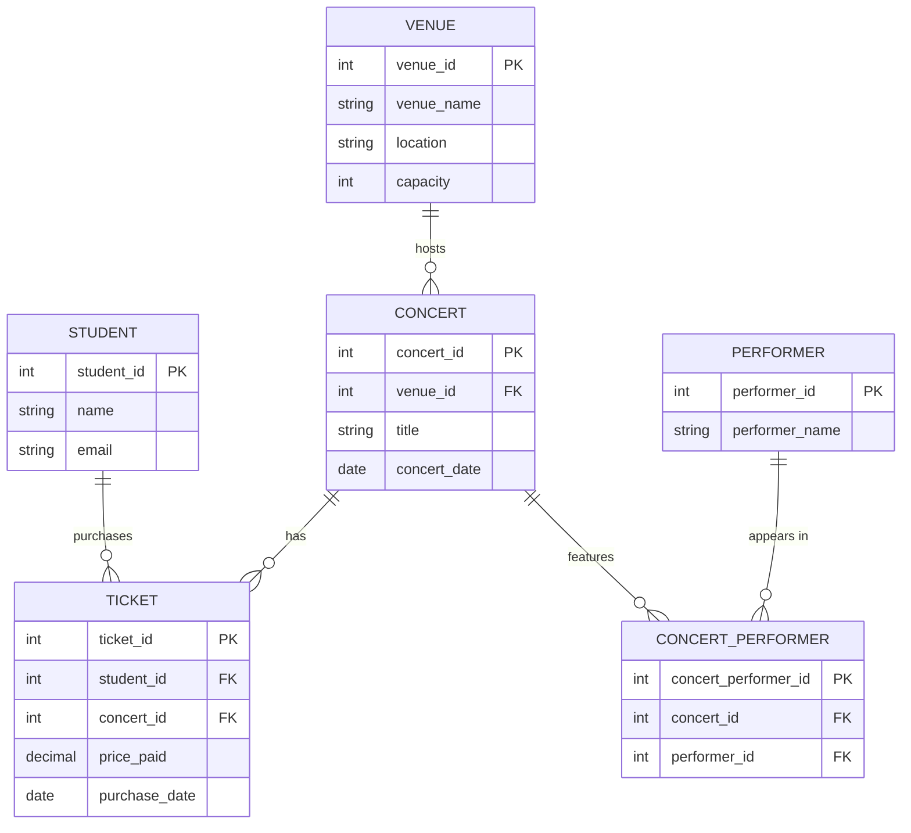

# Chapter 10: Designing for a Business Domain

---

The previous five chapters built your conceptual toolkit: entities and attributes, relationships and keys, normalization, ER diagrams, and queries. Now it's time to put the toolkit to work on real problems.

In practice, database design doesn't start with a clean list of entities and rules. It starts with a business description — sometimes a paragraph of notes from a meeting, sometimes a whiteboard photo, sometimes a spreadsheet that's been emailed around for three years. Your job is to read that description, extract what the database needs to know, make design decisions where the description is ambiguous, and produce a schema that accurately models the business domain.

This chapter walks through that process end to end. We'll tackle a realistic business narrative from scratch, explore the design patterns that appear in almost every business domain, learn how to spot and fix common design problems, and discuss how to communicate design decisions to people who don't think in tables and foreign keys.

---

## 10.1 From Narrative to Schema: An End-to-End Walk-Through

### Reading a business description and identifying design decisions

Real business descriptions are messy. They're written for humans, not databases. They use natural language, imply things they don't state, and leave out details the author considers obvious. Your first task is to read carefully and extract signal from noise.

Let's work through a realistic example. Imagine you're a business analyst at a small company that runs a campus concert ticket platform. Your manager sends you this description:

> *"Students buy tickets to concerts on campus. Each concert has one or more performers, a venue, a date, and a capacity. Students have accounts with their name and email address. When a student buys a ticket, we need to know which concert it's for and how much they paid. Students can buy multiple tickets to the same concert (to bring friends), and the same student can have tickets to multiple concerts. Performers can appear at more than one concert over the course of a semester. We need to be able to look up which concerts a performer is appearing at, and which performers are appearing at a given concert."*

Don't jump to tables yet. Read it twice. Then ask three questions:

**What is being tracked?** Concerts, performers, venues, students, and tickets. Those are your candidate entities.

**For what purpose?** Ticket sales and performer scheduling. The purpose shapes which attributes matter. We care about payment amounts (ticket sales), capacity (venue/event management), and performer scheduling — not, say, a performer's date of birth or a student's major.

**Who uses the data and what do they look for?** Students look up concerts to buy tickets. Staff look up who's performing and whether capacity is available. Both are queries we need to support.

### Extracting entities, attributes, and relationships

Now work through the narrative systematically.

**Underline the nouns.** Students, concerts, performers, venues, tickets, accounts, names, email addresses, dates, capacities, amounts. These are your candidate entities and attributes. Whether a noun becomes an entity or an attribute depends on whether it has its own properties and relationships — or whether it's just a fact about something else.

A venue, for example, has a name, a location, and a capacity. It might appear in many concerts. That's entity behavior. It gets its own table.

A date is just a fact about a concert. It doesn't have relationships of its own, and it doesn't have sub-properties we need to track. It's an attribute of Concert, not its own entity.

**Underline the verbs.** Buys (student → ticket → concert), appears at (performer → concert), has (student → account). Verbs become relationships.

Working through the narrative, here's what we get:

**Entities:** Student, Concert, Performer, Venue, Ticket

**Attributes:**
- Student: student_id (PK), name, email
- Concert: concert_id (PK), venue_id (FK), date, title
- Venue: venue_id (PK), venue_name, location, capacity
- Performer: performer_id (PK), performer_name
- Ticket: ticket_id (PK), student_id (FK), concert_id (FK), price_paid, purchase_date

**Relationships:**
- Concert is held at one Venue; a Venue can host many Concerts → one-to-many, FK lives on Concert
- A Student can buy many Tickets; each Ticket belongs to one Student → one-to-many, FK lives on Ticket
- A Ticket is for one Concert; a Concert has many Tickets → one-to-many, FK lives on Ticket
- A Performer can appear at many Concerts; a Concert can feature many Performers → **many-to-many**, needs a junction table

That last relationship — Performer to Concert — is many-to-many. We need a junction table. Let's call it `ConcertPerformer`.

**ConcertPerformer:** concert_performer_id (PK), concert_id (FK), performer_id (FK)

Here's the resulting ER diagram:



And the relational schema:

```
VENUE (venue_id PK, venue_name, location, capacity)
CONCERT (concert_id PK, venue_id FK, title, concert_date)
PERFORMER (performer_id PK, performer_name)
STUDENT (student_id PK, name, email)
TICKET (ticket_id PK, student_id FK, concert_id FK, price_paid, purchase_date)
CONCERT_PERFORMER (concert_performer_id PK, concert_id FK, performer_id FK)
```

### What is being tracked vs. what is transient

Notice what we *didn't* include. The description says students have "accounts" — but the account is the Student record itself, not a separate entity. "Account" is business language for the student's registration; we don't need a separate Account table unless accounts have properties that students don't (like multiple users sharing one account, or accounts with subscription tiers).

Also notice: we stored `price_paid` on the Ticket, not just a reference to the concert's current price. That's a deliberate design decision. Prices change. If a concert ticket originally cost $15 and we later change the concert's price to $20, we don't want every historical ticket to suddenly appear to have cost $20. The `price_paid` column captures the price *at the time of purchase*. This is a stable fact, not a transient state.

This is a general principle: when recording a transaction, capture the values that were true at the time the transaction occurred. Don't rely on a reference to a current value that might change.

### The iterative nature of database design

The schema above is a good first draft. It is not final. Real design is always iterative.

The next step is to show it to the stakeholders — the people who actually run the concert platform — and ask questions:

- "The description says students can buy multiple tickets to the same concert. Does each ticket get its own record, or do we track quantity?" (Our schema gives each ticket its own row, which is probably right — each row represents one admission.)
- "Do performers have contact information we need to store, like an agent's email or a booking fee?" (If yes, add those attributes to Performer.)
- "Can a concert have more than one venue — like an outdoor stage and an indoor stage?" (Probably not, but if so, the venue relationship becomes many-to-many.)
- "Do we need to track ticket refunds or transfers between students?" (If yes, we might need additional tables or status columns on Ticket.)

Each answer reveals a design decision. Some of those decisions will require changes to the schema. That's not a sign of failure — it's the process working correctly. The first draft surfaces the questions you didn't know to ask.

---

## 10.2 Common Design Patterns

Certain design structures appear across almost every business domain. Recognizing them saves time and prevents common mistakes.

### Orders and line items: the header-detail pattern

One of the most common patterns in business databases is the **header-detail** structure, also called the **order-line item** pattern. It appears in:

- E-commerce orders and their items
- Restaurant bills and their dishes
- Concert tickets and individual seats
- Invoices and invoice line items
- Playlists and the songs they contain

The pattern works like this: there's a **header** table that captures the overall transaction, and a **detail** table that captures the individual items within that transaction.

For an e-commerce example:

```
ORDER (order_id PK, customer_id FK, order_date, shipping_address, status)
ORDER_LINE (line_id PK, order_id FK, product_id FK, quantity, unit_price)
PRODUCT (product_id PK, product_name, current_price, category)
```

The `ORDER` table (header) records facts about the whole purchase: who made it, when, where to ship it, and its current status. The `ORDER_LINE` table (detail) records each item: which product, how many, and at what price.

Why separate tables? Because an order contains a variable number of items — one order might have 1 item, another might have 50. If we tried to put everything in one table, we'd need columns like `product_1`, `product_2`, `product_3`... which is exactly the repeating group problem that 1NF fixes.

**The critical attribute: price at time of purchase.** Notice `unit_price` lives on `ORDER_LINE`, not on `PRODUCT`. Just like our concert ticket example, we're capturing the price that was in effect when the customer bought the item. If the product's price changes tomorrow, historical orders are unaffected.

This is so important it's worth stating as a rule: **in any transaction table, capture prices, rates, or values as they were at the time of the transaction, not as references to a potentially changing current value.**

### Users, roles, and permissions

Another pattern that appears everywhere — in apps, enterprise software, content management systems, and anywhere that different people have different access levels — is the **users-roles-permissions** pattern.

A naive design might add a `role` column directly to the User table:

```
USER (user_id PK, username, email, role)
```

This works for simple cases ("admin" vs. "regular user"), but breaks down quickly:
- What if a user can have multiple roles? (A student who is also a student government officer and a teaching assistant.)
- What if roles have properties of their own? (Each role has a description, a set of permissions, and a date it was last updated.)

The better design uses a junction table:

```
USER (user_id PK, username, email, signup_date)
ROLE (role_id PK, role_name, description)
USER_ROLE (user_role_id PK, user_id FK, role_id FK, assigned_date, assigned_by FK)
```

The junction table `USER_ROLE` captures the many-to-many relationship between users and roles. The `assigned_date` and `assigned_by` columns capture *when* and *by whom* the role was assigned — facts about the assignment itself, not about the user or the role. This is a common junction table pattern: the junction table becomes a record of an event (the assignment), and it can carry attributes about that event.

**Audit columns.** Most real-world tables — especially those tracking users, transactions, or anything that might be audited — include a standard set of columns:

```
created_at    TIMESTAMP    -- when was this row inserted?
created_by    INT (FK)     -- which user inserted it?
updated_at    TIMESTAMP    -- when was it last changed?
updated_by    INT (FK)     -- which user last changed it?
```

These columns are sometimes called **audit columns** or **metadata columns**. They don't represent the core business data, but they answer the question "who did what, and when?" — which is essential for debugging, compliance, and understanding your own data.

Adding `created_at` costs almost nothing. Not having it when you need it costs a lot.

### Events, logs, and time-series data

A third common pattern is the **event log** or **time-series** table. These tables record things that happened, in sequence, and are almost always append-only — rows are added but rarely updated or deleted.

In our music streaming schema, the `STREAM` table is an event log. Each row records one stream event: who listened, to what, and when. The table grows continuously as new streams occur, and you'd never go back and change a historical stream record.

Other examples:

- A login history table (each row = one login attempt)
- A price history table (each row = one price change on a product)
- A shipment tracking table (each row = one status update on a package)
- An audit log (each row = one change made to the database)

Key design characteristics of event tables:

**They almost always have a timestamp.** The time of the event is central to the data's meaning. Without a timestamp, events can't be ordered or analyzed over time.

**They grow indefinitely.** An event table from two years ago still has value. You don't delete rows to "clean up" — the historical data is the point.

**They answer "what happened?" not "what is the current state?"** If you want to know a product's current price, you query the Product table. If you want to know how many times the price has changed, or what it was on a specific date, you query the price history table.

**Querying temporal data.** Two common question types for event tables:

*Snapshot queries* — "What was the state at a specific point in time?"
```sql
-- What was the price of song_id = 42 on March 1, 2026?
SELECT price
FROM PriceHistory
WHERE song_id = 42
  AND effective_date <= '2026-03-01'
ORDER BY effective_date DESC
LIMIT 1;
```

*Range queries* — "What happened during a time period?"
```sql
-- How many streams happened in March 2026?
SELECT COUNT(*) AS march_streams
FROM Stream
WHERE stream_date BETWEEN '2026-03-01' AND '2026-03-31';
```

Understanding the difference between "current state" tables and "event log" tables is one of the most important distinctions in data modeling. Mixing the two — trying to represent event history in a table designed for current state — is a common source of design problems.

---

## 10.3 Spotting and Fixing Poor Designs

Not every database you encounter will be well-designed. As a business professional with relational thinking skills, you'll often be asked to work with existing schemas, troubleshoot problems, or evaluate designs someone else created. This section covers how to recognize design problems and what to do about them.

### Red flags in an existing schema

Some design problems are visible as soon as you look at the schema. Here are the most common warning signs.

**Columns named "misc," "notes," "data," or "other."** A column called `misc_info` or `extra_data` almost certainly contains heterogeneous, unstructured content — a dumping ground for things that didn't fit anywhere else. This is a normalization failure. The data in that column probably belongs in one or more specific columns (or possibly a separate table), but the designer didn't model it explicitly. The result: the column is impossible to query reliably.

**Tables with dozens or hundreds of nullable columns.** If you see a table with 150 columns and most rows have NULLs in 100 of them, the table is probably trying to represent several different kinds of things at once. This is the "one table for everything" anti-pattern. A Product table that has some columns for physical products and other columns (always NULL for physical products) for digital products is a sign that physical and digital products should probably be separate tables, or the design should use a common base table with type-specific child tables.

**Columns that are almost always the same value.** If `status` is `"active"` for 99.9% of rows, the column might not be adding value — or it might be hiding the real design question (when does something become inactive, and what does that mean?).

**Repeated groups as columns instead of rows.** If you see `phone_1`, `phone_2`, `phone_3` in a table, that's a 1NF violation masquerading as a schema. The designer was trying to handle "a person can have multiple phone numbers" but solved it with more columns instead of a separate table.

**Foreign keys that allow NULL where they shouldn't.** A nullable foreign key on Ticket to Concert would mean "a ticket for no particular concert" — which probably shouldn't be possible. If a foreign key is always required, it should be NOT NULL. If it's sometimes optional (like a user's optional profile photo), nullable is correct. But nullable foreign keys that are *supposed* to be required create orphaned-record problems over time.

**No timestamps on transactional tables.** If an Order table has no `order_date`, a Transaction table has no `transaction_time`, or a User table has no `signup_date`, important historical context is missing. This is usually an oversight rather than a deliberate decision, and it often becomes a problem when someone asks "how many new users did we get last month?" and the answer is "we can't tell."

### Recognizing design smells vs. design failures

Not every imperfection is a crisis. Some "design smells" are problems in theory but acceptable in practice. Others are genuine failures that corrupt data.

A **design smell** is a structure that could be better but isn't actively causing harm. Example: storing full state name ("West Virginia") instead of a state code ("WV") is slightly redundant, but it's a minor issue if the data is read often and written rarely.

A **design failure** is a structure that causes data integrity problems, incorrect query results, or inability to record real-world facts. Example: storing multiple phone numbers as a comma-separated list in a single column means you can't query on individual phone numbers, can't count them reliably, and can't add metadata (like "home" vs. "mobile") to each one. That's a failure, not a smell.

When evaluating a schema, ask: "Does this design prevent us from storing something we need to know? Does it produce incorrect query results? Does it allow data to get out of sync?" If the answer is yes, it needs to be fixed. If the answer is no, and the "improvement" is mostly aesthetic, it might not be worth the disruption of changing it.

### Refactoring a bad design without losing data

Changing an existing database schema is much harder than designing a new one, because real data already lives in the existing structure. You have to migrate it — extract it, transform it into the new shape, and load it into the new structure — without losing anything.

The general rule: **additive changes first, breaking changes last (or never).**

**Additive changes** are safe: add a new table, add a column, add an index. These changes don't remove anything and don't break existing queries. You can deploy them at any time.

**Breaking changes** are risky: remove a column, split a table into two, rename a column, change a data type. These break existing queries and application code that references the old structure. They require careful coordination.

A common pattern for safely refactoring a column:
1. Add the new column (additive change)
2. Write a migration script that populates the new column from the old one for all existing rows
3. Update application code to write to both columns during a transition period
4. Verify the new column has correct data for all rows
5. Migrate application code to read from the new column only
6. Only then, remove the old column (breaking change, now safe)

This process is slower than just "fixing" the column, but it preserves data and allows rollback at any stage.

**Testing refactored queries.** After a schema change, verify that your most important queries still return the same results. Run the old query and the new query on the same data snapshot and compare. If they match, the refactor preserved semantics. If they don't match, figure out why before going live.

### A worked example: fixing a poorly designed booking table

Here's a denormalized table someone might have built in a spreadsheet and imported into a database:

**BOOKING (messy version):**
| booking_id | student_name | student_email | concert_title | venue_name | venue_location | performer_1 | performer_2 | concert_date | ticket_price |
|-----------|-------------|--------------|--------------|-----------|---------------|------------|------------|-------------|-------------|
| 1 | Maya Johnson | maya@mu.edu | Spring Jam | Joan C. Edwards | Huntington, WV | The Chills | Wet Leg | 2026-04-15 | 20.00 |
| 2 | Marcus Lee | mlee@mu.edu | Spring Jam | Joan C. Edwards | Huntington, WV | The Chills | Wet Leg | 2026-04-15 | 20.00 |
| 3 | Maya Johnson | maya@mu.edu | Fall Concert | Big Sandy | Huntington, WV | Tyler Childers | | 2026-10-10 | 35.00 |

Problems visible immediately:
- `student_name` and `student_email` repeat for every ticket Maya buys (update anomaly: change her email in one row, miss it in another)
- `venue_name` and `venue_location` repeat for every concert at that venue (same issue)
- `concert_title`, `concert_date`, and `ticket_price` repeat for every ticket to the same concert
- `performer_1` and `performer_2` are a repeating group (what if there are 5 performers? What if there's only 1?)
- A concert with only one performer has an empty `performer_2` column (or NULL)

This is exactly the design we'd produce after running through the end-to-end walk-through in section 10.1. The fix is the normalized schema with separate Student, Concert, Venue, Performer, Ticket, and ConcertPerformer tables. The data migration would:

1. Extract unique students into the Student table
2. Extract unique venues into the Venue table
3. Extract unique concerts into the Concert table (with the venue FK)
4. Parse `performer_1` and `performer_2` into the Performer table (deduplicating)
5. Create ConcertPerformer rows linking each performer to their concert
6. Create Ticket rows linking each booking to the correct student and concert

Step 4 is the hardest: parsing `performer_1` and `performer_2` and deciding whether "The Chills" in two rows is one performer or two. This is why column-per-performer designs are so problematic — migration is painful, and it can be hard to clean up after the fact.

---

## 10.4 Communicating Design Decisions

Database design is as much a communication skill as a technical one. The schemas you design will be used by developers, queried by analysts, explained to managers, and maintained by whoever comes after you. All of these audiences need to understand the design — but they need different things from the explanation.

### Explaining schema choices to non-technical stakeholders

Non-technical stakeholders don't think in tables and foreign keys. They think in business processes, reports, and the questions they want to answer. Your job is to translate.

Instead of: *"The ConcertPerformer table is a junction table resolving a many-to-many relationship between the Concert and Performer entities."*

Say: *"We created a separate 'appearances' record for each performer-concert combination. That's what lets us look up 'which concerts is Tyler Childers performing at?' and 'which performers are on the Spring Jam bill?' from the same structure."*

Instead of: *"The ticket_price column has domain integrity enforced via a CHECK constraint requiring a non-negative value."*

Say: *"The system won't let anyone enter a negative ticket price. If someone tries to record a $-5 ticket, the database will reject it."*

The goal isn't to hide the technical details — it's to connect them to the business problem they solve. Every design decision was made for a reason, and that reason is always expressible in business terms.

**Useful translation patterns:**
- "Foreign key" → "a pointer to the [related table]" or "a reference to the associated [entity]"
- "Junction table" → "a record of the relationship between X and Y" or "an [event/enrollment/assignment] that connects X and Y"
- "NOT NULL constraint" → "a required field — the system won't accept a row without it"
- "Primary key" → "the unique identifier for each [entity]"
- "Normalization" → "we store each fact in exactly one place, so we only have to update it once"

### When to show the ER diagram and when to hide it

The ER diagram is your primary communication tool — but it's not always the right tool for the right audience.

**Show the ER diagram when:**
- You're presenting the design to developers or technical reviewers who will implement it
- You're onboarding a new team member who needs to understand the full schema
- You're documenting the design for future reference
- You're getting design feedback from someone who can read it

**Don't show the ER diagram when:**
- You're explaining to an executive why the ticketing system works the way it does
- You're in a requirements meeting with a business owner who hasn't asked to see a schema
- The diagram is large and complex and the audience only cares about one part of it

For business stakeholders, a simpler visual often works better: a list of the questions the system can now answer, or a mockup of a report the data enables. Lead with the outcome, bring in the diagram only if they ask how it works.

### Using ER diagrams as documentation

A diagram that accurately represents the current schema is one of the most valuable forms of database documentation. It lets a new developer understand the data model in minutes rather than hours. It makes it obvious where to look when a query needs to be written. It surfaces relationships that might not be obvious from the table names alone.

But a diagram that's out of date is worse than no diagram — it actively misleads. If the schema has changed but the diagram hasn't, every decision made based on the outdated diagram is potentially wrong.

Some practices that keep diagrams useful:

**Store the diagram source in version control alongside the schema.** If you're using Mermaid (as we've done throughout this book), the diagram source is plain text that can live in a markdown file next to your SQL migration scripts. When you change the schema, update the diagram at the same time, in the same commit.

**Use the diagram as an onboarding tool.** When a new analyst or developer joins the team, a 15-minute walkthrough of the ER diagram — "here's what each table represents, here are the key relationships, here's how a typical query moves through the schema" — is more valuable than any amount of written documentation.

**Annotate key design decisions.** Add comments to your schema files (SQL supports `-- comment` syntax) explaining *why* important decisions were made, not just what they are. "price_paid is stored on Ticket rather than referenced from Concert because prices change and we need historical accuracy" is the kind of context that's invaluable six months later when someone asks why the column is structured that way.

### The design review as a collaborative conversation

The best way to catch design problems before they become expensive is to get a second set of eyes on the schema before it's built. A design review doesn't have to be formal — it can be 20 minutes with a colleague looking at an ER diagram on a whiteboard.

Useful questions to ask in a design review:

- "Can you walk me through how you'd record [a specific business scenario] in this schema?"
- "What happens if [edge case]? Is that representable?"
- "Which queries will be most common? Let's trace the join path for each one."
- "Is there any fact the business needs to track that this schema can't represent?"
- "Are there any assumptions baked into this design that might change?"

The goal is to find the questions the design can't answer — and either change the design to answer them, or document explicitly that those questions are out of scope. Both outcomes are better than finding out after the system is live.

---

## Chapter Summary

Database design starts not with tables but with a business narrative. The process: read carefully, identify what's being tracked and for what purpose, extract entities (nouns) and relationships (verbs), choose attributes, resolve many-to-many relationships with junction tables, and capture transient facts (like prices at time of purchase) explicitly rather than by reference.

Design is always iterative. The first schema is a draft that surfaces the questions you didn't know to ask. Show it to stakeholders and update it based on what you learn.

Several design patterns appear across almost every business domain: the header-detail (order/line-item) pattern for variable-length transactions; the users-roles-permissions pattern with a junction table for many-to-many access control; and the event log pattern for append-only records of things that happened over time. Audit columns (created_at, created_by, updated_at, updated_by) belong on any table where historical accountability matters.

Red flags in existing schemas: catch-all columns named "misc" or "notes," tables with many nullable columns, repeating groups expressed as numbered columns, nullable foreign keys that should be required, and no timestamps on transactional tables.

Refactoring a bad design requires care: additive changes first, breaking changes last. Test that refactored queries return identical results before going live.

Communicating design decisions means translating technical choices into business language and connecting each decision to the problem it solves. ER diagrams are powerful tools for technical audiences and onboarding; for business stakeholders, lead with what the system can now do, not how it's structured. Keep diagrams in sync with the schema or they become actively misleading.

---

## Key Terms

**Header-detail pattern** — A design structure where a "header" table captures facts about a whole transaction and a "detail" table captures the individual items within it. Also called the order-line item pattern.

**Price at time of purchase** — The practice of storing a price (or rate, or value) directly on a transaction record rather than referencing a current price that may change. Ensures historical accuracy.

**Audit columns** — Standard columns (created_at, created_by, updated_at, updated_by) added to a table to track when rows were inserted or modified and by whom.

**Event log (append-only table)** — A table that records things that happened, in sequence, and grows continuously. Rows are added but rarely updated or deleted.

**Snapshot query** — A query that retrieves the state of something at a specific point in time, typically from an event log or history table.

**Design smell** — A schema structure that could theoretically be better but isn't actively causing data integrity problems or incorrect query results.

**Design failure** — A schema structure that prevents recording real-world facts, produces incorrect query results, or allows data to get out of sync.

**Design review** — A collaborative session where one or more people examine a schema design to find gaps, ambiguities, edge cases, and questions the design can't answer.

---

## Interactive Activities

The activities below are designed to be completed with a generative AI tool such as Claude (claude.ai) or ChatGPT. For each activity, copy the prompt in the gray box and paste it directly into your AI tool to begin an interactive study session.

---

### Activity 10.1 — Concept Check: Design Principles

*This activity checks your understanding of the key ideas from Chapter 10. The AI will quiz you one question at a time and give feedback after each answer.*

---

**Copy and paste this prompt into your AI tool:**

> I've just finished reading Chapter 10 of my Introduction to Databases textbook, which covered the process of going from a business narrative to a schema, common design patterns (header-detail, users-roles, event logs), spotting poor designs, and communicating design decisions. I want to check my understanding. Please quiz me by asking the following questions one at a time. Wait for my answer before moving on. After each answer, tell me what I got right, correct anything I misunderstood, and ask if I'd like to go deeper before moving to the next question.
>
> Here are the questions:
>
> - The chapter says database design always starts with a business narrative. What are the three questions you should ask after reading a business description, before you start thinking about tables?
> - Why does the order-line item (header-detail) pattern use two tables instead of one? What design problem would arise if you tried to put everything in one table?
> - A ticket is sold for $25 today. Tomorrow, the concert changes its price to $30. Where should the $25 price be stored, and why?
> - What are audit columns? Name the four most common ones and explain what each records.
> - What is the difference between a "design smell" and a "design failure"? Give an example of each.
> - What is the difference between an additive schema change and a breaking one? Which is safer to deploy, and why?
> - Why might a column named "misc_info" or "extra_data" be a warning sign in an existing schema?
> - When should you show an ER diagram to a stakeholder, and when should you not? What's the alternative when the diagram isn't the right tool?
> - The chapter says normalization and event logs solve different problems. What's the difference between a "current state" table and an "event log" table?

---

### Activity 10.2 — Apply It: Design from a Business Narrative

*This activity walks you through the full process of going from a business description to a relational schema. The AI will guide you step by step.*

---

**Copy and paste this prompt into your AI tool:**

> I'm studying database design in my Introduction to Databases class. I want to practice the full process of going from a business narrative to a relational schema. Please work through this with me step by step, asking me to do each step before showing me the answer. Wait for my response at each step before moving on. Correct me if I make mistakes and explain why.
>
> Here is the business narrative I want to model:
>
> "A university intramural sports program lets students sign up for recreational leagues. Each league is for one sport (basketball, soccer, volleyball, etc.) and runs for a specific semester. Leagues are divided into teams. Students join a team, and each team is in one league. Games are scheduled between two teams in the same league, and each game has a date, a location (which gym or field), and a final score. Students can be on multiple teams across different leagues (but not two teams in the same league). Coaches are staff members who are assigned to lead one team at a time."
>
> Please guide me through these steps one at a time:
>
> 1. Identify the candidate entities by underlining the nouns in the narrative.
> 2. For each candidate entity, decide: is it an entity (its own table) or an attribute of something else? Have me justify each decision.
> 3. Identify the relationships by looking at the verbs. For each relationship, determine the type (one-to-many or many-to-many).
> 4. For each many-to-many relationship, define the junction table and decide what attributes (if any) it carries.
> 5. List all tables with their columns. For each table, identify the primary key and any foreign keys.
> 6. Identify at least two design decisions that were ambiguous in the narrative and explain how I resolved them.
>
> After I complete all six steps, give me feedback on the overall quality of my design and point out anything I missed or could improve.

---

### Activity 10.3 — Practice: Spot the Design Problems

*This activity gives you practice identifying red flags in poorly designed schemas. The AI will present schemas and ask you to diagnose the problems.*

---

**Copy and paste this prompt into your AI tool:**

> I'm practicing how to spot design problems in existing database schemas. I want you to present me with the following schema descriptions one at a time. For each one, ask me: (a) What design problems can you identify? (b) Is each problem a "design smell" or a "design failure"? (c) How would you fix it?
>
> Wait for my answer each time, tell me what I got right and what I missed, explain each problem and the fix, and then ask if I want to discuss it further before moving on.
>
> Schema 1 — A student information system:
> STUDENT table has columns: student_id, first_name, last_name, email, major, advisor_name, advisor_email, advisor_phone, class_1, class_2, class_3, class_4, class_5, class_6, gpa, notes
>
> Schema 2 — A food delivery app:
> ORDER table has columns: order_id, customer_name, customer_address, restaurant_name, restaurant_address, item_1_name, item_1_price, item_2_name, item_2_price, item_3_name, item_3_price, total, driver_name, driver_phone, status, misc
>
> Schema 3 — A concert ticketing system:
> TICKET table has columns: ticket_id, event_name, event_date, venue_name, price, buyer_email, seat_number
> (No separate Event table exists. The event_name, event_date, and venue_name columns appear in every ticket row for the same concert.)
>
> Schema 4 — A project management app:
> TASK table has columns: task_id, task_name, assigned_user_id, due_date, priority, status, extra_data (JSON blob containing arbitrary metadata added by developers over time)
>
> After we've gone through all four, ask me to design a corrected version of whichever schema I found most challenging to fix.

---

### Activity 10.4 — Case Study: Present a Design to a Stakeholder

*This activity practices translating technical design decisions into business language. The AI plays the role of a non-technical manager.*

---

**Copy and paste this prompt into your AI tool:**

> I'm going to practice explaining a database design to a non-technical stakeholder. You'll play the role of a business manager named Jordan who runs a campus food delivery service and has asked me to design a database for it. Jordan is smart and business-savvy but has never taken a databases course and doesn't know terms like "foreign key," "junction table," or "normalization."
>
> Here is the schema I've designed:
>
> CUSTOMER (customer_id, name, email, dorm_building, signup_date)
> RESTAURANT (restaurant_id, restaurant_name, cuisine_type, location)
> MENU_ITEM (item_id, restaurant_id FK, item_name, current_price, available)
> ORDER (order_id, customer_id FK, order_date, delivery_address, total_amount, status)
> ORDER_LINE (line_id, order_id FK, item_id FK, quantity, price_at_time_of_order)
> DRIVER (driver_id, name, phone, vehicle_type)
> DELIVERY (delivery_id, order_id FK, driver_id FK, pickup_time, dropoff_time, rating)
>
> Please start the roleplay. As Jordan, ask me questions about the design — like why there are so many separate tables, why prices appear in two places (menu_item and order_line), how the system would know which driver delivered which order, and what happens when a restaurant removes an item from the menu. Ask one question at a time and respond naturally as a curious, business-focused manager.
>
> After I've answered five or six questions, step out of character and give me feedback: Did I explain things clearly without using jargon? Did I connect each design decision to a business reason? What could I have explained better?

